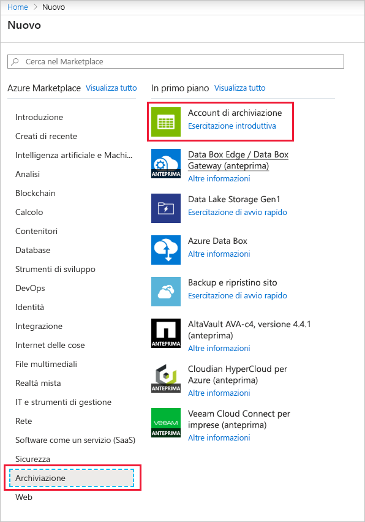
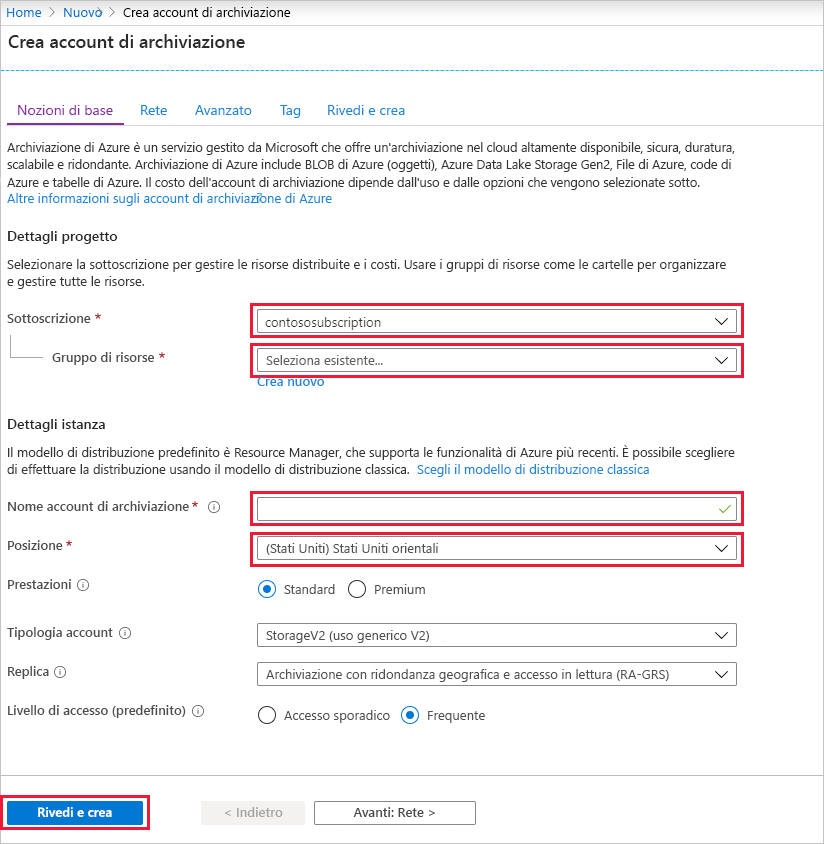
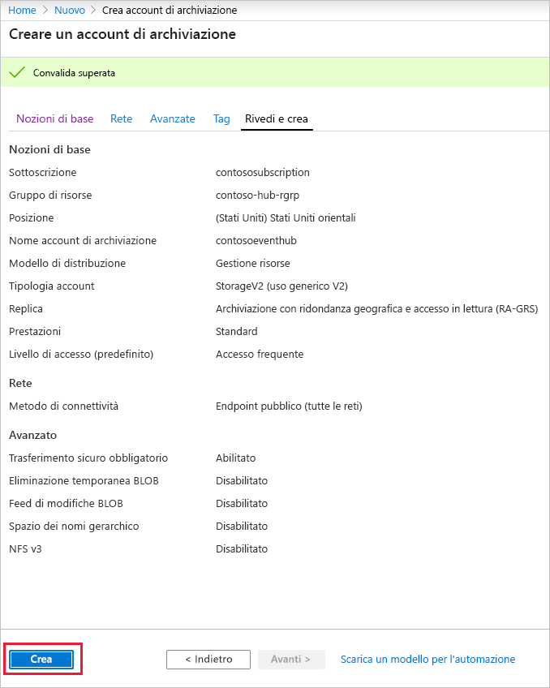
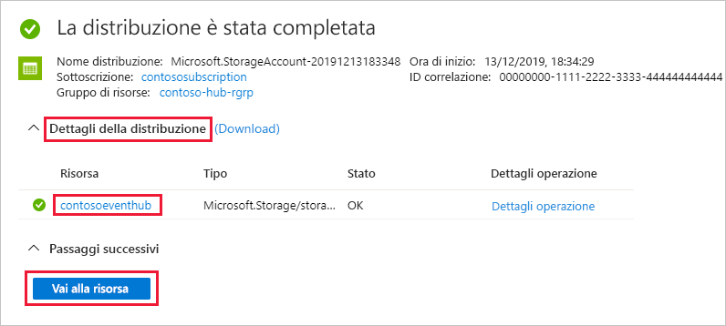
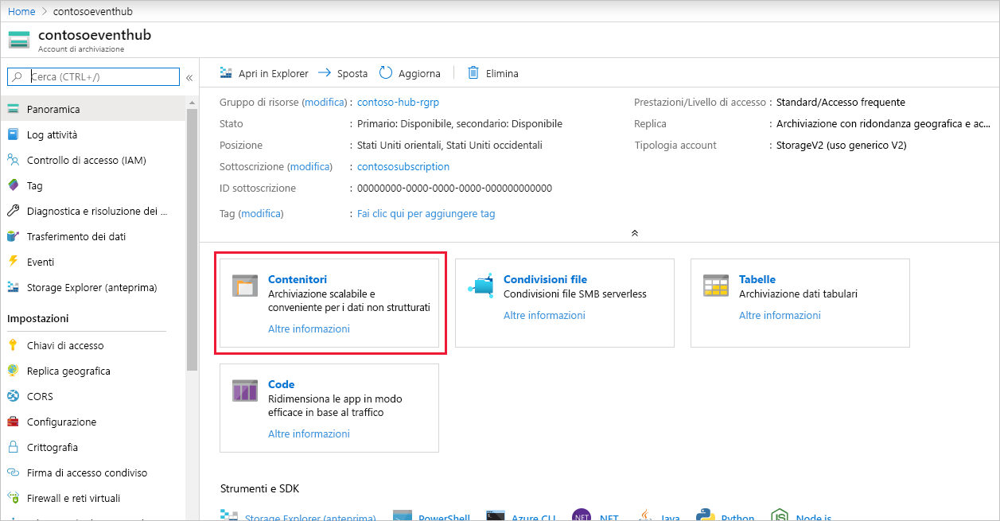
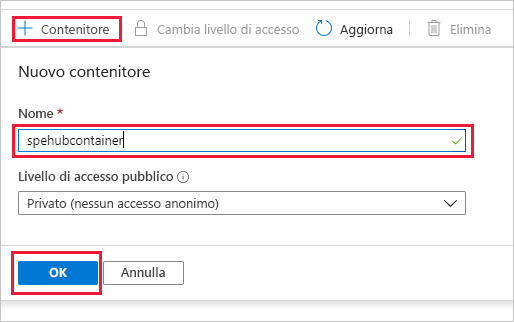

### Creare un account di archiviazione per l'host del processore di eventi
L'host del processore di eventi è un agente intelligente che semplifica la ricezione di eventi da Hub eventi gestendo checkpoint persistenti e ricezioni parallele. Per eseguire il checkpoint, l'host del processore di eventi richiede un account di archiviazione. Nell'esempio seguente viene illustrato come creare un account di archiviazione e come ottenere le relative chiavi di accesso:

1. Nel menu del portale di Azure selezionare **Crea una risorsa**.

    

2. Selezionare **Archiviazione** > **Account di archiviazione**.
   
    

3. Nella pagina **Crea account di archiviazione** eseguire la procedura seguente: 

   1. Immettere un valore in **Nome account di archiviazione**.
   2. Scegliere una sottoscrizione di Azure contenente l'hub eventi in **Sottoscrizione**.
   3. Scegliere o creare il **gruppo di risorse** in cui è incluso l'hub eventi.
   4. Selezionare la **località** in cui creare la risorsa. 
   5. Selezionare **Rivedi e crea**.
   
        

4. Nella pagina **Rivedi e crea** rivedere i valori e selezionare **Crea**. 

    
5. Dopo la visualizzazione del messaggio **Le distribuzioni sono riuscite** nelle notifiche, selezionare **Vai alla risorsa** per aprire la pagina dell'account di archiviazione. In alternativa, è possibile espandere **Dettagli distribuzione** e quindi selezionare la nuova risorsa nell'elenco di risorse.  

     
6. Selezionare **Contenitori**.

    
7. Selezionare **+ Contenitore** in alto, immettere un **nome** per il contenitore e selezionare **OK**. 

    
8. Scegliere **Chiavi di accesso** nel menu della pagina **Account di archiviazione** e copiare il valore di **key1**.

    Salvare i valori seguenti nel Blocco note o in un'altra posizione temporanea.
    - Nome dell'account di archiviazione
    - Chiave di accesso per l'account di archiviazione
    - Nome del contenitore
