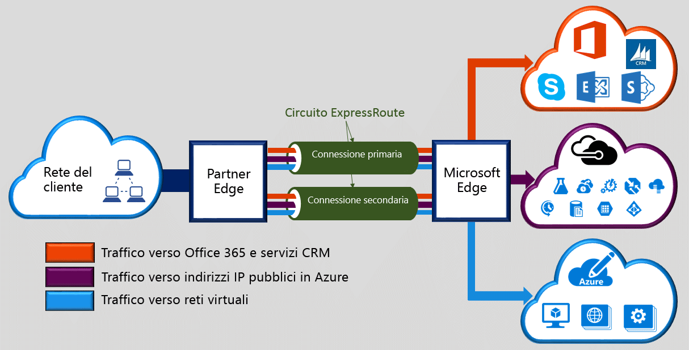

Microsoft Azure ExpressRoute consente di estendere le reti locali nel cloud Microsoft tramite una connessione privata dedicata fornita da un provider di connettività. Con ExpressRoute è possibile stabilire connessioni ai servizi cloud Microsoft, come Microsoft Azure, Office 365 e CRM Online. La connettività può essere stabilita da una rete (IP VPN) any-to-any, da una rete Ethernet punto a punto o da una Cross Connection virtuale tramite un provider di connettività presso una struttura di condivisione del percorso. Le connessioni ExpressRoute non sfruttano la rete Internet pubblica. In questo modo possono offrire un livello di sicurezza superiore, maggiore affidabilità, velocità più elevate e minori latenze rispetto alle connessioni Internet tradizionali.  

<!--HONumber=Jan17_HO1-->

