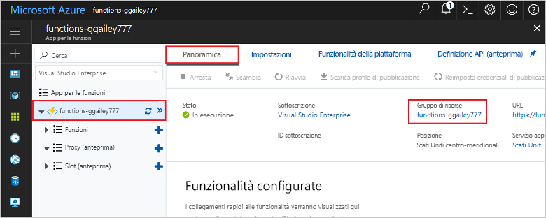

1. In Visual Studio Code premere F1 per aprire il riquadro comandi. Nel riquadro comandi cercare e selezionare `Azure Functions: Open in portal`.

1. Scegliere l'app per le funzioni e premere INVIO. La pagina dell'app per le funzioni viene aperta nel [portale di Azure](https://portal.azure.com).

1. Nella scheda **Panoramica** selezionare il collegamento denominato sotto **Gruppo di risorse**.

    

1. Nella pagina **Gruppo di risorse** esaminare l'elenco delle risorse incluse e verificare che siano quelle da eliminare.
 
1. Selezionare **Elimina gruppo di risorse** e seguire le istruzioni.

   L'eliminazione potrebbe richiedere alcuni minuti. Al termine, viene visualizzata una notifica per pochi secondi. È anche possibile selezionare l'icona a forma di campana nella parte superiore della pagina per visualizzare la notifica.