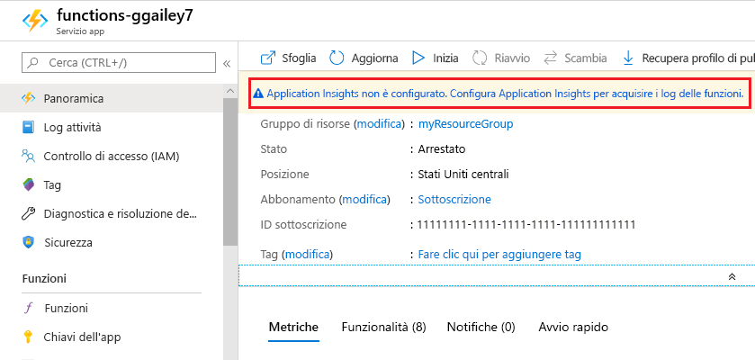
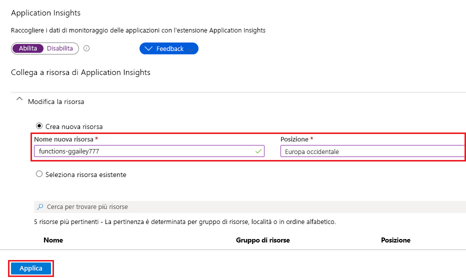

Funzioni semplifica l'aggiunta dell'integrazione di Application Insights a un'app per le funzioni dal [portale di Azure].

1. Nel [portale][portale di Azure] selezionare **Tutti i servizi > App per le funzioni**, selezionare la propria app per le funzioni e quindi il banner **Application Insights** in alto nella finestra

    

1. Creare una risorsa di Application Insights usando le impostazioni specificate nella tabella sotto l'immagine.

   

    | Impostazione      | Valore consigliato  | Descrizione                                        |
    | ------------ |  ------- | -------------------------------------------------- |
    | **Nome** | Nome app univoco | È più facile usare lo stesso nome dell'app per le funzioni, che deve essere univoco nella sottoscrizione. | 
    | **Posizione** | Europa occidentale | Se possibile, usare la stessa [area](https://azure.microsoft.com/regions/) dell'app per le funzioni oppure una vicina a tale area. |

1. Selezionare **OK**. La risorsa di Application Insights viene creata nella stesso gruppo di risorse e nella stessa sottoscrizione dell'app per le funzioni. Dopo aver creato la risorsa, chiudere la finestra di Application Insights.

1. Nell'app per le funzioni selezionare **Impostazioni applicazione** e scorrere fino a **Impostazioni applicazione**. Se viene visualizzata un'impostazione denominata `APPINSIGHTS_INSTRUMENTATIONKEY`, l'integrazione di Application Insights è abilitata per l'app per le funzioni in esecuzione in Azure.

[Portale di Azure]: https://portal.azure.com
