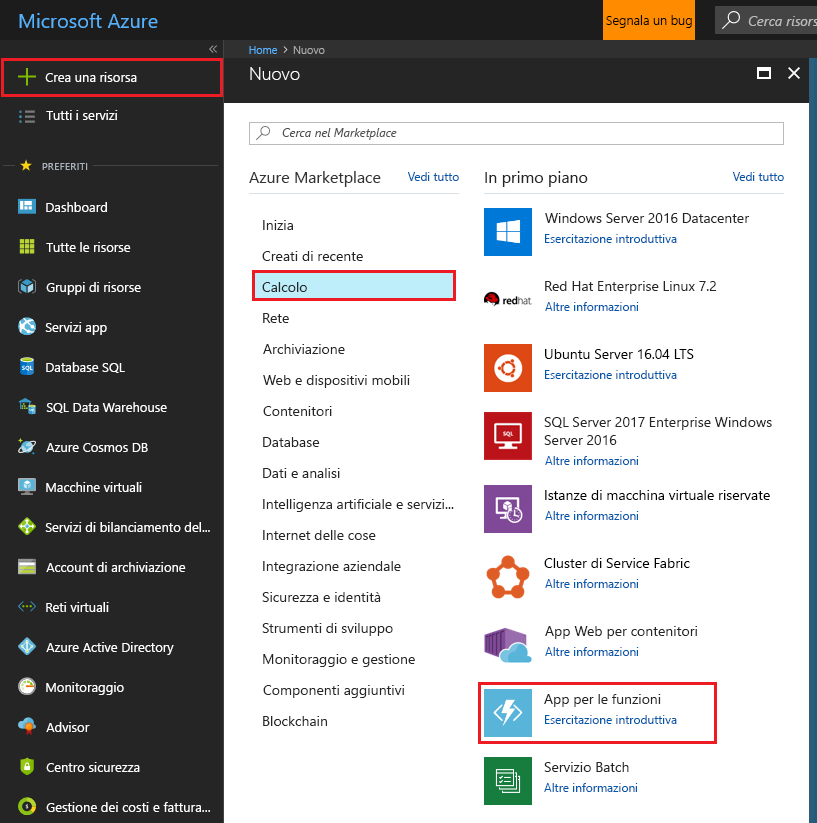
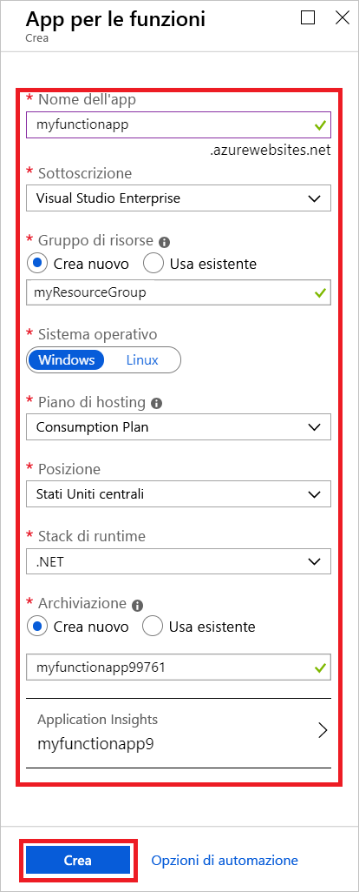

1. Fare clic sul pulsante **Nuovo** nell'angolo superiore sinistro del portale di Azure e quindi selezionare **Calcolo** > **App per le funzioni**. 

    

2. Usare le impostazioni dell'app per le funzioni come indicato nella tabella sottostante l'immagine.

    

    | Impostazione      | Valore consigliato  | Descrizione                                        |
    | ------------ |  ------- | -------------------------------------------------- |
    | **Nome app** | Nome globalmente univoco | Nome che identifica la nuova app per le funzioni. I caratteri validi sono `a-z`, `0-9` e `-`.  | 
    | **Sottoscrizione** | Sottoscrizione in uso | La sottoscrizione in cui verrà creata questa nuova app per le funzioni. | 
    | **[Gruppo di risorse](../articles/azure-resource-manager/resource-group-overview.md)** |  myResourceGroup | Nome del nuovo gruppo di risorse in cui creare l'app per le funzioni. | 
    | **Sistema operativo** | Windows | L'hosting senza server attualmente è disponibile solo in un ambiente di esecuzione su Windows. Per l'hosting su Linux, vedere [Creare la prima funzione eseguita in Linux usando l'interfaccia della riga di comando di Azure](../articles/azure-functions/functions-create-first-azure-function-azure-cli-linux.md). |
    | **[Piano di hosting](../articles/azure-functions/functions-scale.md)** |   Piano a consumo | Piano di hosting che definisce come vengono allocate le risorse all'app per le funzioni. Nel **piano a consumo** predefinito le risorse vengono aggiunte dinamicamente in base alle esigenze delle funzioni. In questo hosting [senza server](https://azure.microsoft.com/overview/serverless-computing/) si paga solo per il periodo in cui le funzioni sono in esecuzione.   |
    | **Posizione** | Europa occidentale | Scegliere una località nelle vicinanze o vicino ad altri servizi a cui accederanno le funzioni. |
    | **[Account di archiviazione](../articles/storage/common/storage-create-storage-account.md#create-a-storage-account)** |  Nome globalmente univoco |  Nome del nuovo account di archiviazione usato dall'app per le funzioni. I nomi degli account di archiviazione devono avere una lunghezza compresa tra 3 e 24 caratteri e possono contenere solo numeri e lettere minuscole. È possibile anche usare un account esistente. |

1. Fare clic su **Crea** per effettuare il provisioning della nuova app per le funzioni e distribuirla.
