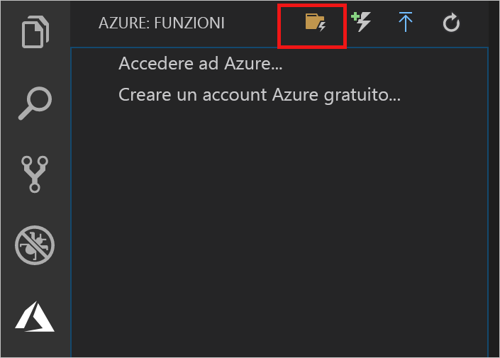
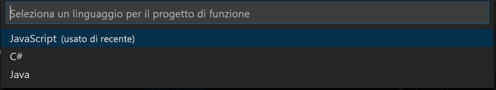

## Creare un progetto di Funzioni di Azure

Il modello di progetto Funzioni di Azure in Visual Studio Code crea un progetto che può essere pubblicato in un'app per le funzioni in Azure. Un'app per le funzioni consente di raggruppare le funzioni come un'unità logica per la gestione, la distribuzione e la condivisione delle risorse.

1. In Visual Studio Code selezionare il logo di Azure per visualizzare l'area **Azure: Funzioni** e quindi selezionare l'icona Crea nuovo progetto.

    

1. Scegliere una posizione per l'area di lavoro del progetto e quindi scegliere **Seleziona**.

    > [!NOTE]
    > Questo articolo è stato progettato per il completamento all'esterno di un'area di lavoro. In questo caso, non selezionare una cartella di progetto inclusa in un'area di lavoro.

1. Selezionare il linguaggio per il progetto di app per le funzioni. In questo articolo viene usato JavaScript.
    

1. Quando richiesto, scegliere **Aggiungi a area di lavoro**.

Visual Studio Code crea il progetto di app per le funzioni in una nuova area di lavoro. Questo progetto contiene i file di configurazione [host.json](../articles/azure-functions/functions-host-json.md) e [local.settings.json](../articles/azure-functions/functions-run-local.md#local-settings-file), oltre ad altri file di progetto specifici per il linguaggio. La cartella del progetto include anche un nuovo repository Git.