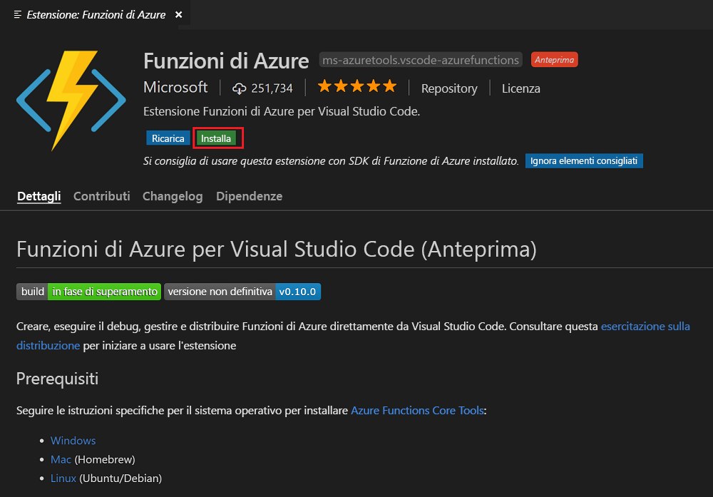
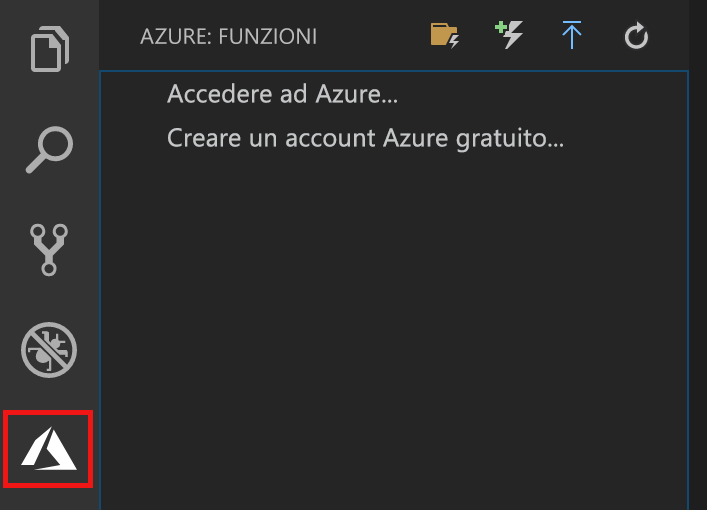

## Installare l'estensione Funzioni di Azure

È possibile usare l'estensione Funzioni di Azure per creare e testare funzioni e distribuirle in Azure.

1. In Visual Studio Code aprire **Estensioni** e cercare **Funzioni di Azure** oppure [selezionare questo collegamento in Visual Studio Code](vscode:extension/ms-azuretools.vscode-azurefunctions).

1. Selezionare **Installa** per installare l'estensione per Visual Studio Code:

    

1. Riavviare Visual Studio Code e selezionare l'icona di Azure sulla barra delle attività. Dovrebbe essere visualizzata un'area Funzioni di Azure sulla barra laterale.

    