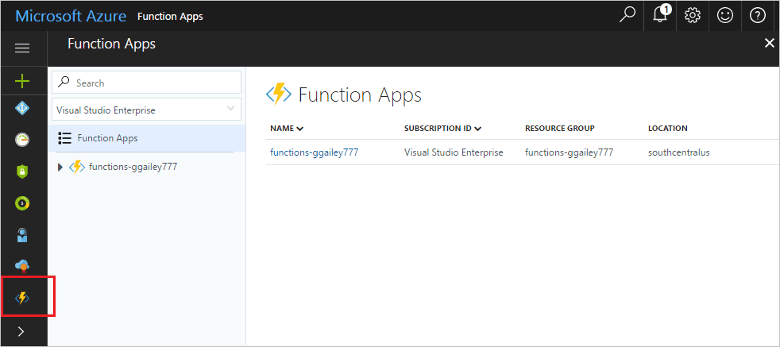

## Aggiungere App per le funzioni ai Preferiti del portale 

Se non è già stato fatto, aggiungere App per le funzioni ai Preferiti del portale di Azure, in modo da trovare più facilmente le app per le funzioni. Se è stato già fatto, passare alla sezione successiva. 

1. Accedere al [Portale di Azure](https://portal.azure.com/).

2. Fare clic sulla freccia in basso a sinistra per espandere tutti i servizi, digitare `Functions` nel campo **Filtro** e quindi fare clic sulla stella accanto a **App per le funzioni**.  
 
    

    L'icona Funzioni viene aggiunta al menu disponibile nella parte sinistra del portale.

3. Chiudere il menu e scorrere verso il basso fino a trovare l'icona Funzioni. Fare clic sull'icona per visualizzare l'elenco di tutte le app per le funzioni. Fare clic sull'app per le funzioni per eseguire operazioni sulle funzioni all'interno dell'app. 
 
    
 
     