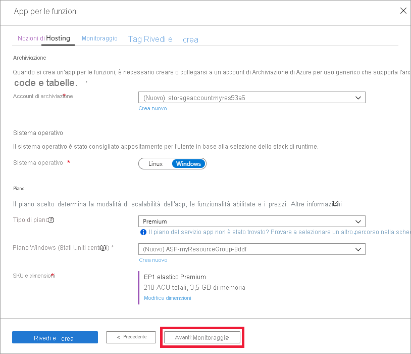

1. Aprire il portale di Azure da[https://portal.azure.com](https://portal.azure.com)

1. Selezionare il pulsante **Crea una risorsa**

    

1. Selezionare **calcolo** > **app per le funzioni**.

    

1. Usare le impostazioni dell'app per le funzioni come indicato nella tabella sottostante l'immagine.

    

    | Impostazione      | Valore consigliato  | Descrizione |
    | ------------ | ---------------- | ----------- |
    | **Sottoscrizione** | Sottoscrizione in uso | Sottoscrizione in cui viene creata questa nuova app per le funzioni. |
    | **[Gruppo di risorse](../articles/azure-resource-manager/management/overview.md)** |  *myResourceGroup* | Nome del nuovo gruppo di risorse in cui creare l'app per le funzioni. |
    | **Nome dell'app per le funzioni** | Nome globalmente univoco | Nome che identifica la nuova app per le funzioni. I caratteri validi sono `a-z` (senza distinzione tra maiuscole e minuscole), `0-9` e `-`.  |
    |**Pubblica**| Codice | Opzione per la pubblicazione di file di codice o di un contenitore Docker. |
    | **Stack di runtime** | Lingua preferita | Scegliere un runtime che supporti il linguaggio di programmazione della funzione preferito. Scegliere **.NET** per le funzioni C# e F #. |
    |**Area**| Area preferita | Scegliere un'[area](https://azure.microsoft.com/regions/) nelle vicinanze o vicino ad altri servizi a cui accedono le funzioni. |

    Selezionare il pulsante **Avanti: Hosting >** .

1. Immettere le impostazioni di hosting seguenti.

    

    | Impostazione      | Valore consigliato  | Descrizione |
    | ------------ | ---------------- | ----------- |
    | **[Account di archiviazione](../articles/storage/common/storage-account-create.md)** |  Nome globalmente univoco |  Creare un account di archiviazione usato dall'app per le funzioni. I nomi degli account di archiviazione devono avere una lunghezza compresa tra 3 e 24 caratteri e possono contenere solo numeri e lettere minuscole. È anche possibile usare un account esistente, che deve soddisfare i [requisiti dell'account di archiviazione](../articles/azure-functions/functions-scale.md#storage-account-requirements). |
    |**Sistema operativo**| Sistema operativo preferito | Viene preselezionato automaticamente un sistema operativo in base alla selezione dello stack di runtime, ma, se necessario, è possibile modificare l'impostazione. |
    | **[Piano](../articles/azure-functions/functions-scale.md)** | Premium | Per tipo di piano selezionare **Premium (anteprima)** e selezionare le impostazioni predefinite per il *piano di Windows* e le selezioni di *dimensioni e SKU* . |

    Selezionare il pulsante **Next: monitoring >** .

1. Immettere le impostazioni di monitoraggio seguenti.

    

    | Impostazione      | Valore consigliato  | Descrizione |
    | ------------ | ---------------- | ----------- |
    | **[Application Insights](../articles/azure-functions/functions-monitoring.md)** | Impostazione predefinita | Crea una risorsa di Application Insights con lo stesso *nome di app* nell'area più vicina supportata. Espandendo questa impostazione, è possibile cambiare il **Nome nuova risorsa** oppure scegliere una **Località** in un'[area geografica di Azure](https://azure.microsoft.com/global-infrastructure/geographies/) in cui si vogliono archiviare i dati. |

    Selezionare **Rivedi e crea** per rivedere le selezioni effettuate per la configurazione dell'app.

1. Selezionare **Crea** per effettuare il provisioning dell'app per le funzioni e distribuirla.