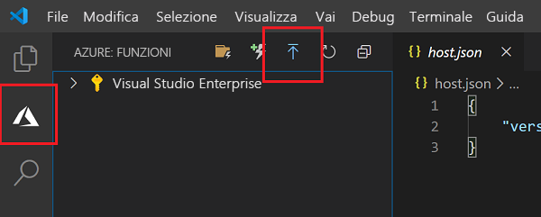
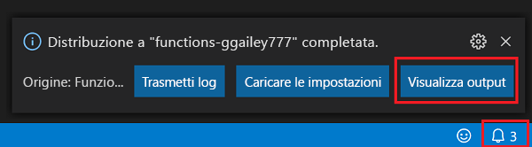
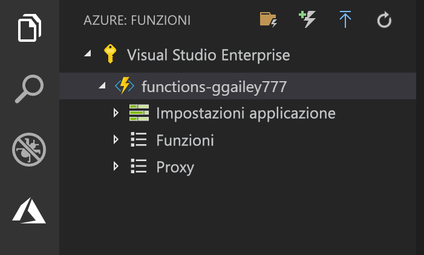

## Pubblicare il progetto in Azure

Visual Studio Code consente di pubblicare il progetto di Funzioni direttamente in Azure. Durante il processo vengono create un'app per le funzioni e le risorse correlate nella sottoscrizione di Azure. L'app per le funzioni fornisce un contesto di esecuzione per le funzioni. Il progetto viene inserito in un pacchetto e distribuito nella nuova app per le funzioni nella sottoscrizione di Azure. 

In questo articolo si presuppone che venga creata una nuova app per le funzioni. La pubblicazione in un'app per le funzioni esistente sovrascrive il contenuto di tale app in Azure.

1. Nell'area **Azure: Funzioni** selezionare l'icona per la distribuzione nell'app per le funzioni.

    

1. Scegliere la cartella di progetto, che corrisponde all'area di lavoro corrente.

1. Se sono presenti più sottoscrizioni, scegliere quella in cui si vuole che venga ospitata l'app per le funzioni e quindi scegliere **+ Crea nuova App per le funzioni**.

1. Digitare un nome univoco globale che identifichi l'app per le funzioni, quindi premere INVIO. I caratteri validi per un nome di app per le funzioni sono `a-z`, `0-9` e `-`.

1. Scegliere **+ Crea nuovo gruppo di risorse**, digitare un nome di gruppo di risorse, ad esempio `myResourceGroup`, quindi premere INVIO. È anche possibile usare un gruppo di risorse esistente.

1. Scegliere **+Crea un nuovo account di archiviazione**, digitare un nome univoco globale per il nuovo account di archiviazione usato dall'app per le funzioni e quindi premere INVIO. I nomi degli account di archiviazione devono avere una lunghezza compresa tra 3 e 24 caratteri e possono contenere solo numeri e lettere minuscole. È possibile anche usare un account esistente.

1. Scegliere una località in un'[area](https://azure.microsoft.com/regions/) nelle vicinanze o vicino ad altri servizi a cui accedono le funzioni.

    La creazione dell'app per le funzioni inizia dopo la selezione della località. Dopo la creazione dell'app per le funzioni e dopo l'applicazione del pacchetto di distribuzione viene visualizzata una notifica.

1. Selezionare **Visualizza output** nelle notifiche per visualizzare i risultati della creazione e della distribuzione, incluse le risorse di Azure create.

    

1. Annotare l'URL della nuova app per le funzioni in Azure. L'URL verrà usato per testare la funzione dopo la pubblicazione del progetto in Azure.

    

1. Nell'area **Azure: Funzioni** viene visualizzata la nuova app per le funzioni nella sottoscrizione. Quando si espande questo nodo, vengono visualizzate le funzioni disponibili nell'app per le funzioni, oltre alle impostazioni dell'applicazione e ai proxy di funzioni.

    

    Dal nodo dell'app per le funzioni digitare CTRL e fare clic (clic con il pulsante destro del mouse) per scegliere le diverse attività di gestione e configurazione da eseguire per l'app per le funzioni in Azure. È anche possibile scegliere di visualizzare l'app per le funzioni nel portale di Azure.
