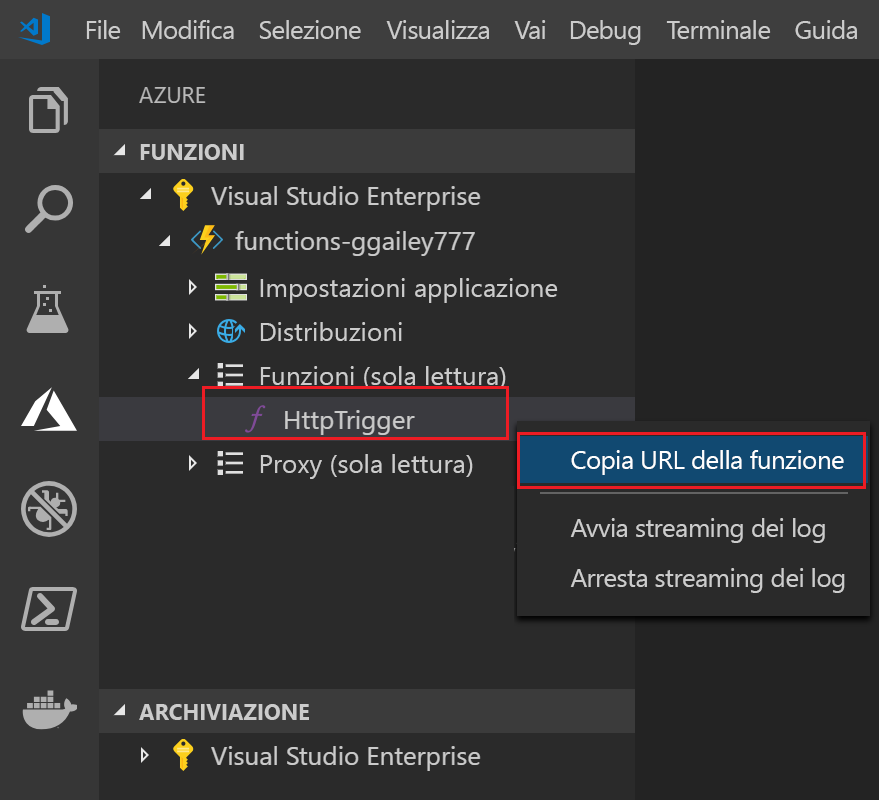

## Pubblicare il progetto in Azure

Visual Studio Code consente di pubblicare il progetto di Funzioni direttamente in Azure. Durante il processo vengono create un'app per le funzioni e le risorse correlate nella sottoscrizione di Azure. L'app per le funzioni fornisce un contesto di esecuzione per le funzioni. Il progetto viene inserito in un pacchetto e distribuito nella nuova app per le funzioni nella sottoscrizione di Azure.

Per impostazione predefinita, Visual Studio crea tutte le risorse di Azure necessarie per creare l'app per le funzioni. I nomi di queste risorse sono basati sul nome dell'app per le funzioni selezionata. Se è necessario disporre del controllo completo delle risorse create, è possibile invece [pubblicare utilizzando le opzioni avanzate](../articles/azure-functions/functions-develop-vs-code.md#enabled-publishing-with-advanced-create-options).

In questa sezione si presuppone che venga creata una nuova app per le funzioni in Azure.

> [!IMPORTANT]
> La pubblicazione in un'app per le funzioni esistente sovrascrive il contenuto di tale app in Azure.

1. In Visual Studio Code premere F1 per aprire il riquadro comandi. Nel riquadro comandi cercare e selezionare `Azure Functions: Deploy to function app...`.

1. Se non è stato ancora eseguito l'accesso, viene visualizzata la richiesta per **accedere ad Azure**. È anche possibile **creare un account di Azure gratuito**. Dopo l'accesso dal browser, tornare a Visual Studio Code. 

1. Se si hanno più sottoscrizioni, **selezionare una sottoscrizione** per l'app per le funzioni e quindi scegliere l'opzione **+ Create New Function App in Azure** (+ Crea nuova app per le funzioni in Azure).

1. Digitare un nome univoco globale che identifichi l'app per le funzioni, quindi premere INVIO. I caratteri validi per un nome di app per le funzioni sono `a-z`, `0-9` e `-`.

    Quando si preme INVIO, nella sottoscrizione vengono create le risorse di Azure seguenti:

    * **[Gruppo di risorse](../articles/azure-resource-manager/resource-group-overview.md)** : contiene tutte le risorse di Azure create. Il nome si basa sul nome dell'app per le funzioni.
    * **[Account di archiviazione](../articles/storage/common/storage-quickstart-create-account.md)** : viene creato un account di archiviazione standard con un nome univoco basato sul nome dell'app per le funzioni.
    * **[Piano di hosting](../articles/azure-functions/functions-scale.md)** : nell'area Stati Uniti occidentali viene creato un piano a consumo per l'hosting dell'app per le funzioni.
    * **App per le funzioni**: il progetto viene distribuito ed eseguito nella nuova app per le funzioni.

    Dopo la creazione dell'app per le funzioni e dopo l'applicazione del pacchetto di distribuzione viene visualizzata una notifica. Selezionare **Visualizza output** nelle notifiche per visualizzare i risultati della creazione e della distribuzione, incluse le risorse di Azure create.

1. Nell'area **Azure: Funzioni** espandere la nuova app per le funzioni nella sottoscrizione. Espandere **Funzioni**, fare clic con il pulsante destro del mouse su **HttpTrigger** e quindi scegliere **Copy function URL** (Copia l'URL della funzione).

    
