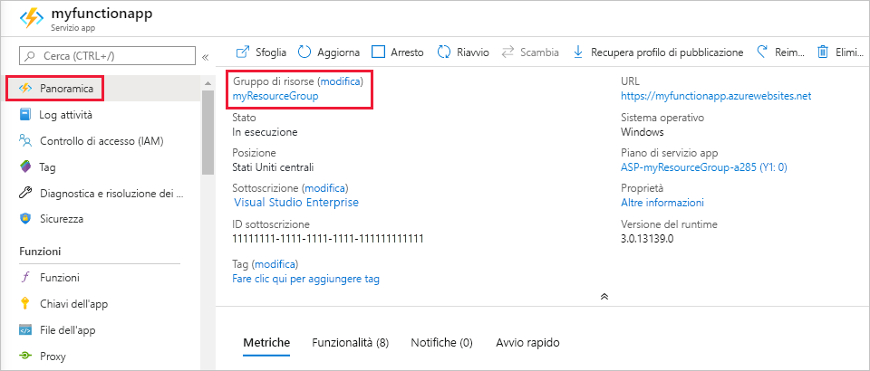

Altre guide introduttive di questa raccolta si basano sui valori di questa guida introduttiva. Se si prevede di continuare a usare le guide introduttive successive o le esercitazioni, non eliminare le risorse create in questa guida introduttiva. 

Se non si prevede di continuare, fare clic su **Gruppo di risorse** per l'app per le funzioni nel portale e quindi fare clic su **Elimina**. 

