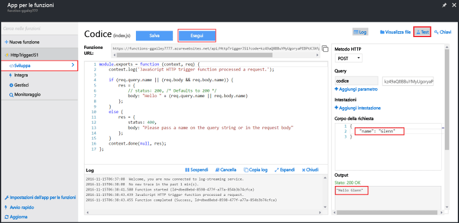

Grazie al codice funzionale contenuto negli avvii rapidi di Funzioni di Azure, è possibile testare immediatamente la nuova funzione.

1. Nella scheda **Sviluppo** esaminare la finestra **Codice** e osservare che questo codice Node.js prevede una richiesta HTTP con un valore *name* passato nel corpo del messaggio o in una stringa di query. Durante l'esecuzione della funzione, questo valore viene restituito nel messaggio di risposta.
   
2. Fare clic su **Test** per visualizzare il pannello di richiesta di test HTTP predefinito per la funzione.
 
    

3. Nella casella di testo **Corpo della richiesta** modificare il valore della proprietà *name* specificando un nome personalizzato e quindi fare clic su **Esegui**. L'esecuzione viene attivata da una richiesta HTTP di test, le informazioni vengono scritte nei log e in **Output** viene visualizzata la risposta "hello". 

4. Per attivare l'esecuzione della stessa funzione da uno strumento di test HTTP o da un'altra finestra del browser, copiare il valore di **URL funzione** dalla scheda **Sviluppo** e incollarlo nella barra degli indirizzi del browser o dello strumento. Aggiungere quindi il valore della stringa di query `&name=yourname` all'URL ed eseguire la richiesta. Si noti che le stesse informazioni vengono scritte nei log e che la stessa stringa è contenuta nel corpo del messaggio di risposta.

    

<!--HONumber=Feb17_HO1-->

