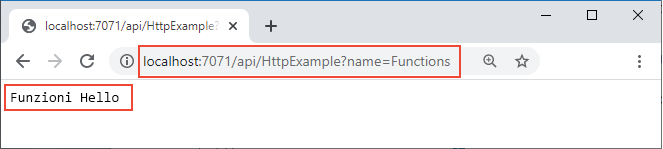

## <a name="run-the-function-locally"></a>Eseguire la funzione in locale

Eseguire la funzione avviando l'host di runtime locale di Funzioni di Azure nella cartella *LocalFunctionProj*:

::: zone pivot="programming-language-csharp,programming-language-powershell,programming-language-javascript,programming-language-python"
```
func start
```
::: zone-end

::: zone pivot="programming-language-typescript"
```
npm install
npm start
```
::: zone-end

Verso la fine dell'output, verranno visualizzate le righe seguenti: 

<pre>
...

Now listening on: http://0.0.0.0:7071
Application started. Press Ctrl+C to shut down.

Http Functions:

        HttpExample: [GET,POST] http://localhost:7071/api/HttpExample
...

</pre>

>[!NOTE]  
> Se HttpExample non viene visualizzato come illustrato di seguito, è probabile che l'host sia stato avvito dalla cartella *HttpExample*. In tal caso, premere **CTRL**+**C** per arrestare l'host, passare alla cartella padre *LocalFunctionProj* ed eseguire di nuovo il comando precedente.

Copiare l'URL della funzione `HttpExample` da questo output in un browser e aggiungere la stringa di query `?name=<your-name>`, rendendo l'URL completo come `http://localhost:7071/api/HttpExample?name=Functions`. Nel browser dovrebbe essere visualizzato un messaggio simile a `Hello Functions`:



Il terminale in cui è stato eseguito `func start` mostra anche l'output del log quando si effettuano le richieste.

Quando si è pronti, premere **CTRL**+**C** e scegliere `y` per arrestare l'host di Funzioni.