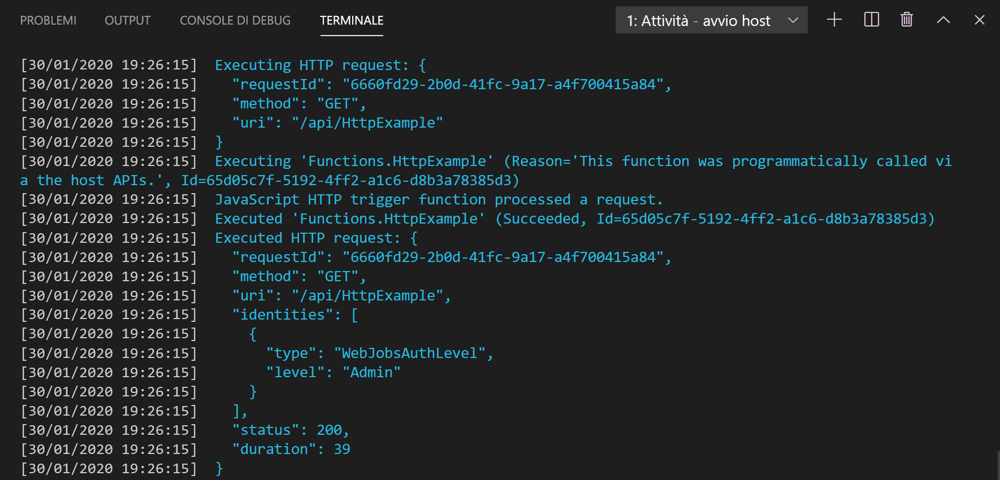

## <a name="run-the-function-locally"></a>Eseguire la funzione in locale

Azure Functions Core Tools si integra con Visual Studio Code per consentire l'esecuzione e il debug di un progetto di Funzioni di Azure in locale. Per informazioni dettagliate su come eseguire il debug in Visual Studio Code, vedere [Eseguire il debug di Funzioni di Azure di PowerShell di Azure in locale](../articles/azure-functions/functions-debug-powershell-local.md). 

1. Premere F5 per avviare il progetto di app per le funzioni. L'output dagli strumenti di base viene visualizzato nel pannello **Terminale**.

1. Nel pannello **Terminale** copiare l'endpoint dell'URL della funzione attivata da HTTP.

    

1. Aggiungere la stringa di query `?name=<yourname>` all'URL e quindi usare `Invoke-RestMethod` in un secondo prompt dei comandi di PowerShell per eseguire la richiesta, come segue:

    ```powershell
    PS > Invoke-RestMethod -Method Get -Uri http://localhost:7071/api/HttpTrigger?name=PowerShell
    Hello PowerShell
    ```

    È anche possibile eseguire la richiesta GET da un browser dall'URL seguente:

    `http://localhost:7071/api/HttpExample?name=PowerShell`

    Quando si chiama l'endpoint HttpTrigger senza passare un parametro `name` come parametro di query o nel corpo, la funzione restituisce un errore `BadRequest`. Quando si esamina il codice in run.ps1, si noterà che questo errore si verifica per impostazione predefinita.

1. Le informazioni sulla richiesta sono visualizzate nel pannello **Terminale**.

    

1. Al termine, premere **CTRL + C** per arrestare Core Tools.

Dopo aver verificato la corretta esecuzione della funzione nel computer locale, è possibile pubblicare il progetto in Azure.