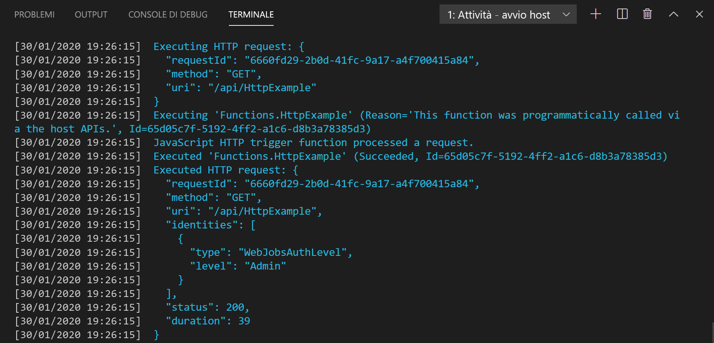

## Eseguire la funzione in locale

Visual Studio Code si integra con [Azure Functions Core Tools](../articles/azure-functions/functions-run-local.md) per consentire l'esecuzione di questo progetto nel computer di sviluppo locale prima della pubblicazione in Azure.

1. Per chiamare la funzione, premere <kbd>F5</kbd> per avviare il progetto di app per le funzioni. L'output dagli strumenti di base viene visualizzato nel pannello **Terminale**.

1. Se Azure Functions Core Tools non è ancora stato installato, selezionare **Installa** quando richiesto. Dopo aver installato Core Tools, l'app viene avviata nel pannello **Terminale**. È possibile visualizzare l'endpoint dell'URL della funzione attivata da HTTP eseguita in locale.

    

1. Con Core Tools in esecuzione, passare all'URL seguente per eseguire una richiesta GET, che include la stringa di query `?name=Functions`.

    `http://localhost:7071/api/HttpExample?name=Functions`

1. Viene restituita una risposta simile alla seguente in un browser:

    

1. Le informazioni sulla richiesta sono visualizzate nel pannello **Terminale**.

    

1. Premere <kbd>CTRL+C</kbd> per arrestare Core Tools e disconnettere il debugger.
