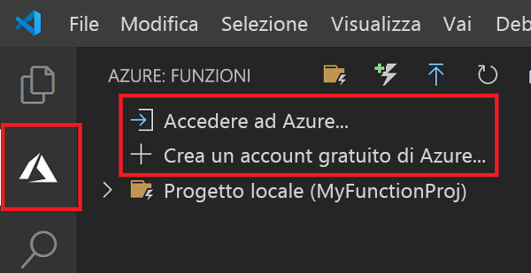

## Accedere ad Azure

Prima di potere pubblicare l'app, è necessario accedere ad Azure.

1. Nell'area **Azure: Funzioni** scegliere **Accedi ad Azure**. Se non si ha già un account, è possibile **creare un account Azure gratuito**.

    

1. Quando richiesto, selezionare **Copia e apri** oppure copiare il codice visualizzato e aprire <https://aka.ms/devicelogin> nel browser.

1. Incollare il codice copiato nella pagina **Accesso dispositivo**, verificare l'accesso per Visual Studio Code, quindi selezionare **Continua**.  

1. Completare l'accesso usando le credenziali dell'account Azure. Dopo avere completato correttamente l'accesso, è possibile chiudere il browser.
