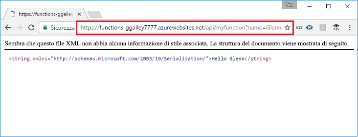

## <a name="test"></a>Testare la funzione

Usare cURL per testare la funzione distribuita in un computer Mac o Linux oppure usando Bash per Windows. Eseguire il comando cURL seguente, sostituendo il segnaposto `<app_name>` con il nome dell'app per le funzioni. Aggiungere la stringa di query `&name=<yourname>` all'URL.

```bash
curl http://<app_name>.azurewebsites.net/api/HttpTriggerJS1?name=<yourname>
```  

  

Se nella riga di comando non è disponibile un cURL, immettere lo stesso URL nella barra degli indirizzi del browser Web. Sostituire il segnaposto `<app_name>` con il nome dell'app per le funzioni, aggiungere la stringa di query `&name=<yourname>` all'URL ed eseguire la richiesta. 

    http://<app_name>.azurewebsites.net/api/HttpTriggerJS1?name=<yourname>
   
  
