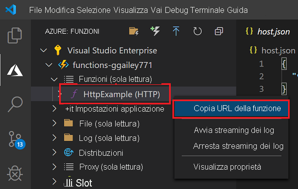
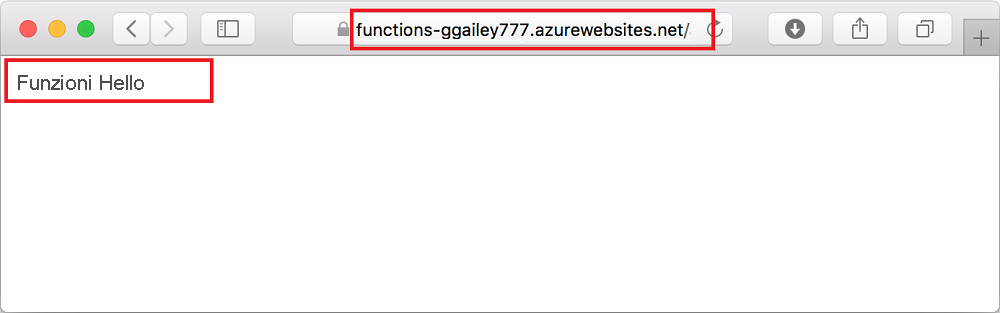

## <a name="run-the-function-in-azure"></a>Eseguire la funzione in Azure

1. Nell'area **Azure: Funzioni** nella barra laterale espandere la nuova app per le funzioni nella sottoscrizione. Espandere **Funzioni** , fare clic con il pulsante destro del mouse su (Windows) o premere <kbd>CTRL +</kbd> clic (macOS) su **HttpExample** e quindi scegliere **Copy function URL** (Copia URL funzione).

    

1. Incollare questo URL per la richiesta HTTP nella barra degli indirizzi del browser, aggiungere alla fine la stringa di query `name` come `?name=Functions`, quindi eseguire la richiesta. Il formato dell'URL che chiama la funzione attivata tramite HTTP sarà simile al seguente:

    ```http
    http://<FUNCTION_APP_NAME>.azurewebsites.net/api/httpexample?name=Functions
    ```

    L'esempio seguente mostra la risposta nel browser alla richiesta GET remota restituita dalla funzione:

    
