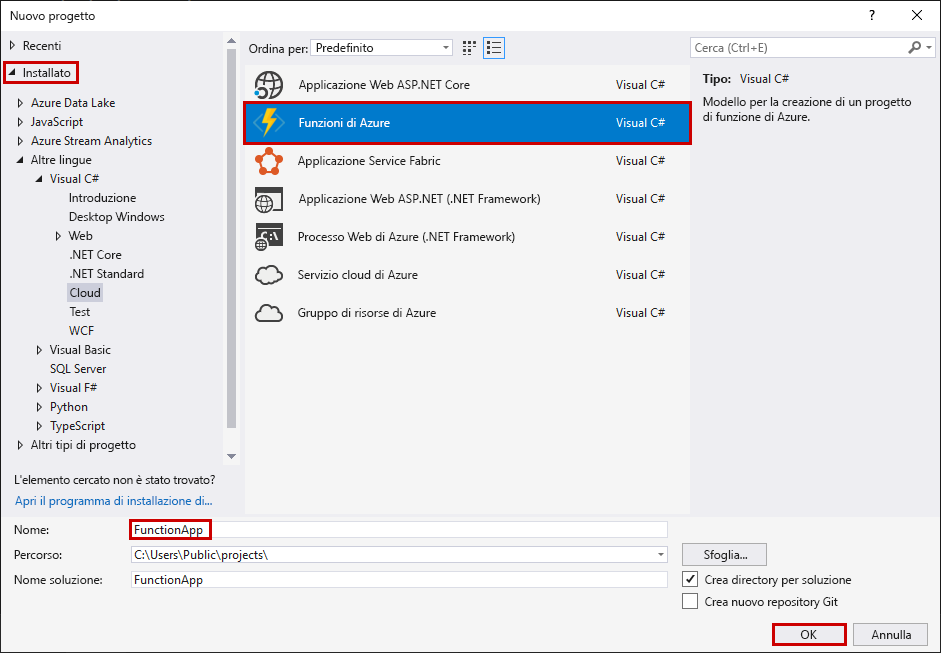
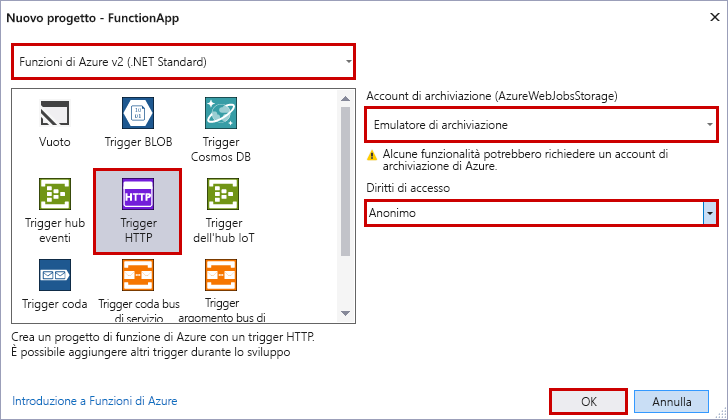

Il modello di progetto Funzioni di Azure in Visual Studio crea un progetto che può essere pubblicato in un'app per le funzioni in Azure. Un'app per le funzioni consente di raggruppare le funzioni come un'unità logica per la gestione, la distribuzione e la condivisione delle risorse.

1. In Visual Studio selezionare **Nuovo** > **Progetto** dal menu **File**.

2. Nella finestra di dialogo **Nuovo progetto** selezionare **Installato**, espandere **Visual C#** > **Cloud**, selezionare **Funzioni di Azure**, digitare un **nome** per il progetto e fare clic su **OK**. Il nome dell'app per le funzioni deve essere valido come spazio dei nomi C#, quindi non usare caratteri di sottolineatura, trattini o altri caratteri non alfanumerici.

    

3. Usare le impostazioni specificate nella tabella disponibile sotto l'immagine.

     

    | Impostazione      | Valore consigliato  | Descrizione                      |
    | ------------ |  ------- |----------------------------------------- |
    | **Versione** | Funzioni di Azure 2.x  (.NET Core) | Viene creato un progetto per le funzioni che usa la versione 2.x del runtime di Funzioni di Azure e supporta .NET Core. Funzioni di Azure 1.x supporta .NET Framework. Per altre informazioni, vedere [Come specificare le versioni del runtime per Funzioni di Azure](../articles/azure-functions/functions-versions.md).   |
    | **Modello** | Trigger HTTP | Viene creata una funzione attivata da una richiesta HTTP. |
    | **Account di archiviazione**  | Emulatore di archiviazione | Un trigger HTTP non usa la connessione dell'account di archiviazione. Tutti gli altri tipi di trigger richiedono una stringa di connessione dell'account di archiviazione valida. |
    | **Diritti di accesso** | Anonima | Viene creata una funzione che può essere attivata da qualsiasi client senza dover fornire una chiave. Questa impostazione di autorizzazione consente di testare più facilmente la nuova funzione. Per altre informazioni sulle chiavi e l'autorizzazione, vedere [Chiavi autorizzazione](../articles/azure-functions/functions-bindings-http-webhook.md#authorization-keys) in [Associazioni HTTP e webhook](../articles/azure-functions/functions-bindings-http-webhook.md). |
4. Fare clic su **OK** per creare il progetto per le funzioni e la funzione attivata da HTTP.
