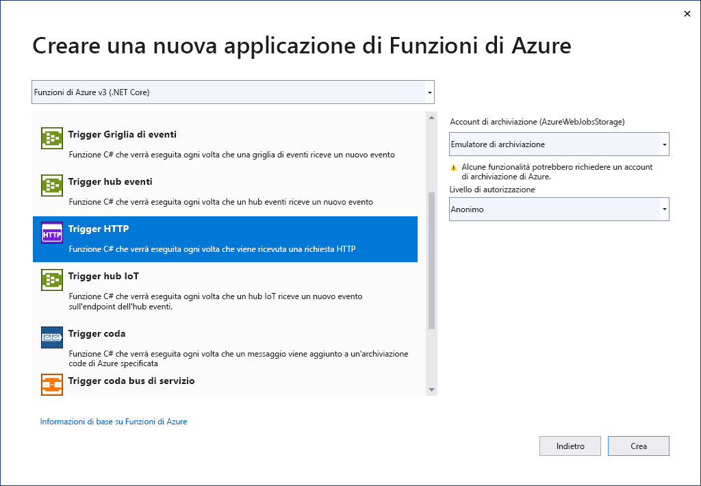

Il modello di progetto Funzioni di Azure in Visual Studio crea un progetto che è possibile pubblicare in un'app per le funzioni in Azure. È possibile usare un'app per le funzioni per raggruppare le funzioni in un'unità logica e semplificare la gestione, la distribuzione, il ridimensionamento e la condivisione delle risorse.

1. Nel menu di Visual Studio selezionare **File** > **Nuovo** > **Progetto**.

1. In **Crea un nuovo progetto** immettere *funzioni* nella casella di ricerca, scegliere il modello **Funzioni di Azure** e quindi selezionare **Avanti**.

1. In **Configura il nuovo progetto** immettere un **nome** per il progetto e quindi selezionare **Crea**. Il nome dell'app per le funzioni deve essere valido come spazio dei nomi C#, quindi non usare caratteri di sottolineatura, trattini o altri caratteri non alfanumerici.

1. Per le impostazioni di **Crea una nuova applicazione Funzioni di Azure** usare i valori della tabella seguente:

    | Impostazione      | valore  | Descrizione                      |
    | ------------ |  ------- |----------------------------------------- |
    | **Runtime di Funzioni** | **Funzioni di Azure v3  (.NET Core)** | Con questo valore viene creato un progetto per le funzioni che usa la versione 3.x del runtime di Funzioni di Azure e supporta .NET Core 3.x. Funzioni di Azure 1.x supporta .NET Framework. Per altre informazioni, vedere [Panoramica delle versioni del runtime per Funzioni di Azure](../articles/azure-functions/functions-versions.md).   |
    | **Modello di funzione** | **Trigger HTTP** | Con questo valore viene creata una funzione attivata da una richiesta HTTP. |
    | **Account di archiviazione (AzureWebJobsStorage)**  | **Emulatore di archiviazione** | Poiché per una funzione di Azure è richiesto un account di archiviazione, ne viene assegnato o creato uno quando si pubblica il progetto in Azure. Un trigger HTTP non usa una stringa di connessione dell'account di archiviazione di Azure. Tutti gli altri tipi di trigger richiedono una stringa di connessione dell'account di archiviazione di Azure valida.  |
    | **Livello di autorizzazione** | **Anonimo** | Viene creata una funzione che può essere attivata da qualsiasi client senza dover fornire una chiave. Questa impostazione di autorizzazione consente di testare più facilmente la nuova funzione. Per altre informazioni sulle chiavi e l'autorizzazione, vedere [Chiavi di autorizzazione](../articles/azure-functions/functions-bindings-http-webhook-trigger.md#authorization-keys) in [Associazioni di webhook e HTTP](../articles/azure-functions/functions-bindings-http-webhook.md). |
    
    
    

    Assicurarsi di impostare **Livello di autorizzazione** su **Anonimo**. Se si sceglie il livello predefinito **Funzione**, è necessario fornire la [chiave di funzione](../articles/azure-functions/functions-bindings-http-webhook-trigger.md#authorization-keys) nelle richieste di accesso all'endpoint della funzione.

1. Selezionare **Crea** per creare il progetto di funzione e la funzione attivata da HTTP.
