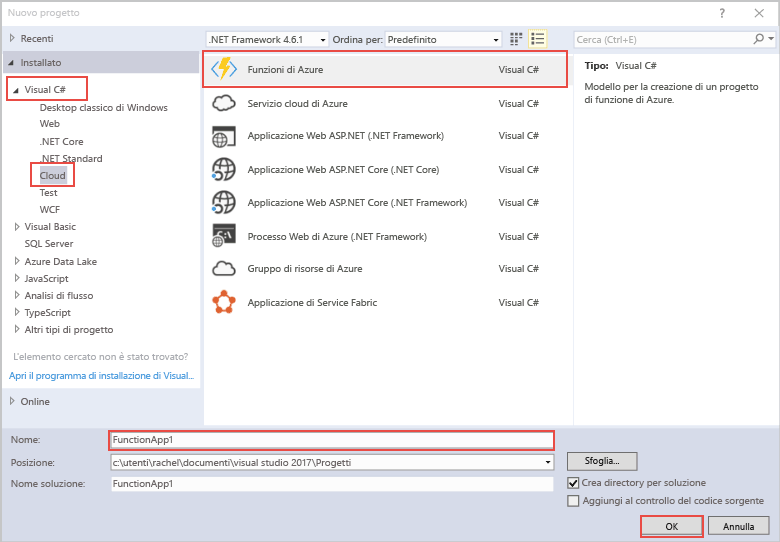

Il modello di progetto Funzioni di Azure in Visual Studio crea un progetto che può essere pubblicato in un'app per le funzioni in Azure. Un'app per le funzioni consente di raggruppare le funzioni come un'unità logica per semplificare la gestione, la distribuzione e la condivisione delle risorse.   

1. Fare clic con il pulsante destro del mouse sul nodo del progetto in **Esplora soluzioni** e quindi scegliere **Aggiungi** > **Nuovo elemento**. Selezionare **Funzione di Azure** nella finestra di dialogo.

2. Nella finestra di dialogo **Nuovo progetto** espandere il nodo **Visual C#** > **Cloud**, selezionare **Funzioni di Azure**, digitare un **nome** per il progetto e fare clic su **OK**. Il nome dell'app per le funzioni deve essere valido come spazio dei nomi C#, quindi non usare caratteri di sottolineatura, trattini o altri caratteri non alfanumerici. 

    