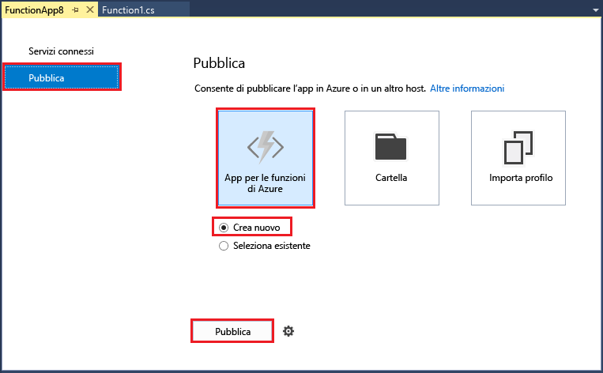
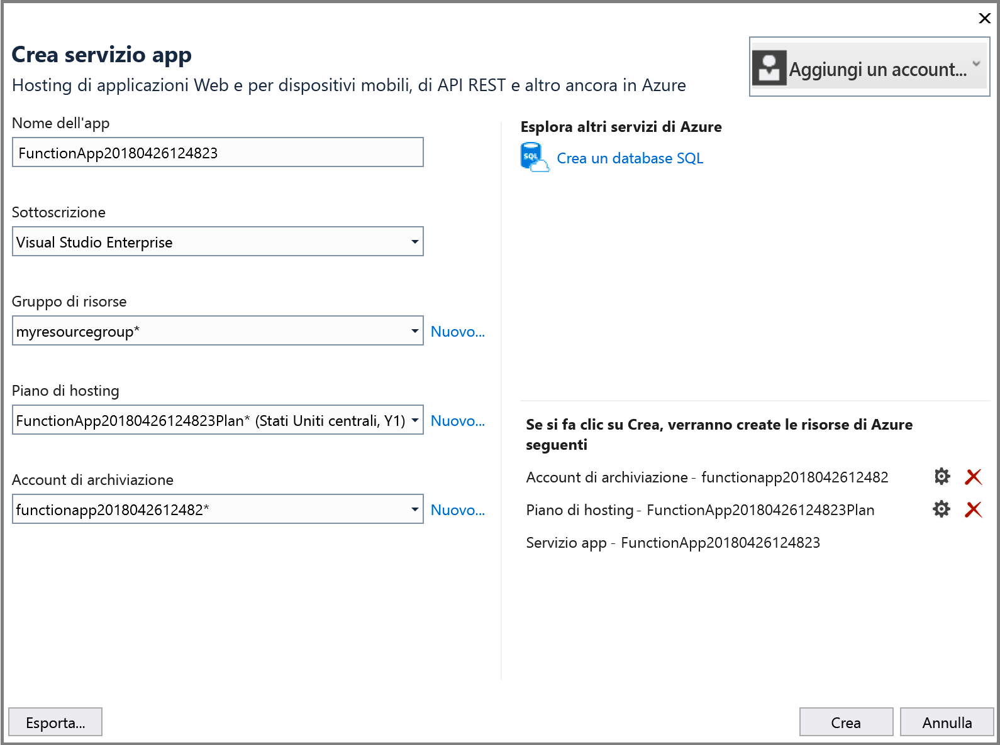
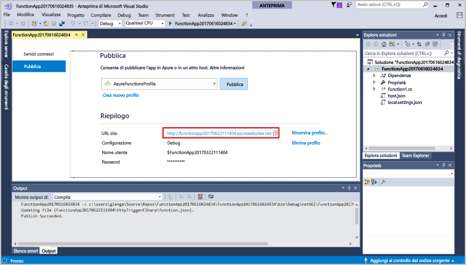

1. In **Esplora soluzioni** fare clic con il pulsante destro del mouse sul progetto e scegliere **Pubblica**. Selezionare **Crea nuovo** e quindi **Pubblica**. 

    

2. Se non si è ancora connesso Visual Studio al proprio account di Azure, selezionare **Aggiungi un account...**.  

3. Nella finestra **Crea servizio app** usare le impostazioni di **hosting** specificate nella tabella seguente: 

    

    | Impostazione      | Valore consigliato  | DESCRIZIONE                                |
    | ------------ |  ------- | -------------------------------------------------- |
    | **Nome app** | Nome globalmente univoco | Nome che identifica in modo univoco la nuova app per le funzioni. |
    | **Sottoscrizione** | Scegliere la sottoscrizione | Sottoscrizione di Azure da usare. |
    | **[Gruppo di risorse](../articles/azure-resource-manager/resource-group-overview.md)** | myResourceGroup |  Nome del gruppo di risorse in cui creare l'app per le funzioni. Per creare un nuovo gruppo di risorse scegliere **Nuovo**.|
    | **[Piano di servizio app](../articles/azure-functions/functions-scale.md)** | Piano a consumo | Dopo aver fatto clic su **Nuovo** per creare un nuovo piano, assicurarsi di scegliere **Consumo** in **Dimensioni**. Scegliere anche una **Località**  nelle [vicinanze](https://azure.microsoft.com/regions/) o vicino ad altri servizi a cui accedono le funzioni.  |

    >[!NOTE]
    >L'account di archiviazione di Azure è necessario per il runtime di Funzioni. Per questo motivo, viene creato automaticamente un nuovo account di Archiviazione di Azure quando si crea un'app per le funzioni.

4. Fare clic su **Crea** per creare un'app per le funzioni e le relative risorse in Azure con queste impostazioni e distribuire il codice di progetto della funzione. 

5. Al termine della distribuzione prendere nota del valore di **URL sito**, ovvero l'indirizzo dell'app per le funzioni in Azure.

    
