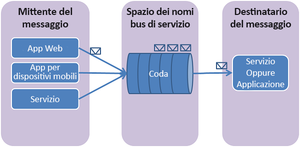

## Informazioni sulle code del bus di servizio
Le code del bus di servizio supportano un modello di comunicazione con **messaggistica negoziata** . Quando si usano le code, i componenti di un'applicazione distribuita non comunicano direttamente l'uno con l'altro, ma scambiano messaggi tramite una coda, che agisce da intermediario (broker). Un producer di messaggi (mittente) invia un messaggio alla coda e quindi prosegue con la relativa elaborazione. In modo asincrono, il consumer di messaggi (ricevitore) recupera il messaggio dalla coda e lo elabora. Il producer non deve attendere la risposta del consumer per continuare a elaborare e inviare ulteriori messaggi. Le code consentono un recapito dei messaggi di tipo **FIFO (First In, First Out)** a uno o più consumer concorrenti. In base a questo metodo, in genere i messaggi vengono ricevuti ed elaborati nell'ordine temporale in cui sono stati aggiunti alla coda e ogni messaggio viene ricevuto ed elaborato da un solo consumer.

Le code del bus di servizio sono una tecnologia di carattere generale che può essere usata in numerosi scenari:

* Comunicazione tra ruoli Web e di lavoro in un'applicazione Azure multilivello.
* Comunicazione tra app locali e app ospitate in Azure in una soluzione ibrida.
* Comunicazione tra componenti di un'applicazione distribuita in esecuzione in locale in organizzazioni diverse o in reparti diversi della stessa organizzazione.

L'uso delle code consente la scalabilità delle applicazioni e garantisce maggiore resilienza all'architettura.

