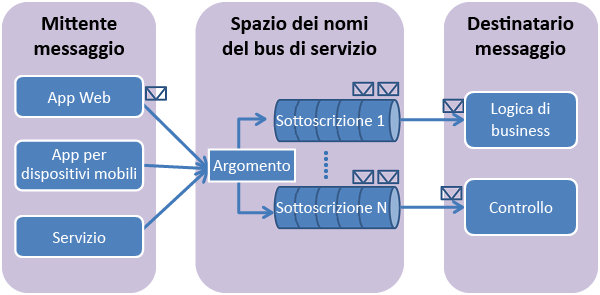

## Cosa sono gli argomenti e le sottoscrizioni del bus di servizio?
Gli argomenti e le sottoscrizioni del bus di servizio supportano un modello di comunicazione con messaggistica di *pubblicazione-sottoscrizione*. Quando si usano gli argomenti e le sottoscrizioni, i componenti di un'applicazione distribuita non comunicano direttamente l'uno con l'altro, ma scambiano messaggi tramite un argomento, che agisce da intermediario.

Diversamente dalle code del bus di servizio, in cui ogni messaggio viene elaborato da un unico consumer, gli argomenti e le sottoscrizioni offrono una forma di comunicazione "uno a molti" tramite un modello di pubblicazione-sottoscrizione. È possibile registrare più sottoscrizioni a un argomento. Quando un messaggio viene inviato a un argomento, viene reso disponibile affinché ogni sottoscrizione possa gestirlo o elaborarlo in modo indipendente.

La sottoscrizione a un argomento è simile a una coda virtuale che riceve copie dei messaggi che sono stati inviati all'argomento. È possibile registrare regole di filtro per un argomento in base alla sottoscrizione, per poter filtrare o limitare quali messaggi relativi a un argomento vengono ricevuti dalle diverse sottoscrizioni dell'argomento.

Gli argomenti e le sottoscrizioni del bus di servizio consentono la scalabilità e l'elaborazione di grandi quantità di messaggi tra un numero elevato di utenti e applicazioni.

## Creare uno spazio dei nomi
Per iniziare a usare gli argomenti e le sottoscrizioni del bus di servizio in Azure, è necessario creare prima di tutto uno *spazio dei nomi del servizio*. Uno spazio dei nomi fornisce un contenitore di ambito per fare riferimento alle risorse del bus di servizio all'interno dell'applicazione.

Per creare uno spazio dei nomi:

1. Accedere al [portale di Azure][portale di Azure].
2. Nel riquadro di spostamento sinistro del portale fare clic su **Nuovo**, quindi su **Enterprise Integration** e infine su **Bus di servizio**.
3. Nella finestra di dialogo **Crea spazio dei nomi** immettere un nome per lo spazio dei nomi. Verrà effettuato immediatamente un controllo sulla disponibilità del nome.
4. Dopo aver verificato che il nome dello spazio dei nomi sia disponibile, scegliere il piano tariffario, ovvero Basic, Standard o Premium.
5. Nel campo **Sottoscrizione** scegliere una sottoscrizione di Azure in cui creare lo spazio dei nomi.
6. Nel campo **Gruppo di risorse** scegliere un gruppo di risorse esistente nel quale risiederà lo spazio dei nomi oppure crearne uno nuovo.
7. In **Località** scegliere il paese o l'area in cui deve essere ospitato lo spazio dei nomi.
   
    ![Creare lo spazio dei nomi][create-namespace]
8. Selezionare il pulsante **Create**. A questo punto, lo spazio dei nomi verrà creato e abilitato nel sistema. Potrebbero essere necessari alcuni minuti per consentire al sistema di effettuare il provisioning delle risorse per lo spazio dei nomi creato.

### Ottenere le credenziali
1. Nell'elenco degli spazi dei nomi fare clic sul nome dello spazio dei nomi appena creato.
2. Nel pannello **Spazio dei nomi del bus di servizio** fare clic su **Criteri di accesso condivisi**.
3. Nel pannello **Criteri di accesso condivisi** fare clic su **RootManageSharedAccessKey**.
   
    ![connection-info][connection-info]
4. Nel pannello **Criteri: RootManageSharedAccessKey** fare clic sul pulsante Copia accanto a **Stringa di connessione - chiave primaria** per copiare la stringa di connessione negli Appunti e usarla in un secondo momento.
   
    ![connection-string][connection-string]

[portale di Azure]: https://portal.azure.com
[create-namespace]: ./media/howto-service-bus-topics/create-namespace.png
[connection-info]: ./media/howto-service-bus-topics/connection-info.png
[connection-string]: ./media/howto-service-bus-topics/connection-string.png

<!---HONumber=AcomDC_0824_2016-->