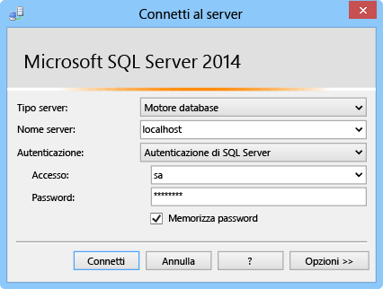

In questa sezione viene illustrato come installare SQL Server Express, abilitare TCP/IP, impostare una porta statica e creare un database che può essere usato con le connessioni ibride.

###Installare SQL Server Express

Per usare un'istanza di SQL Server locale o un database SQL Server Express con una connessione ibrida, TCP/IP deve essere abilitato su una porta statica. A differenza delle istanze denominate, le istanze predefinite di SQL Server usano la porta statica 1433. Per questo motivo, verrà installata l'istanza predefinita. Se si dispone già dell'istanza predefinita di SQL Server Express installata, è possibile ignorare questa sezione.

1. Per installare SQL Server Express, eseguire il file **SQLEXPRWT_x64_ENU.exe** o **SQLEXPR_x86_ENU.exe** scaricato. Viene visualizzata la procedura guidata Centro installazione SQL Server.
	
2. Scegliere **Nuova installazione autonoma di SQL Server o aggiunta di funzionalità a un'installazione esistente**, quindi seguire le istruzioni, accettando le scelte predefinite finché non viene visualizzata la pagina **Configurazione istanza**.
	
3. In **Configurazione istanza** selezionare **Istanza predefinita**, quindi accettare le impostazioni predefinite nella pagina **Configurazione server**.

	>[AZURE.NOTE]Se si dispone già di un'istanza predefinita di SQL Server installata, è possibile passare alla sezione successiva e usare questa istanza con le connessioni ibride.
	
5. Nella pagina **Configurazione del motore di database**, in **Modalità di autenticazione**, scegliere **Modalità mista (autenticazione di SQL Server e autenticazione di Windows)** e mettere a disposizione una password di protezione per l'account amministratore **sa** incorporato.
	
	In questa esercitazione l'utente userà l'autenticazione SQL Server. Prendere nota della password specificata, perché sarà necessaria in seguito.
	
6. Eseguire gli altri passaggi della procedura guidata per completare l'installazione.

###Abilitare TCP/IP e impostare una porta statica

Questa sezione usa SQL Server Configuration Manager, installato al momento dell'installazione di SQL Express, per abilitare il protocollo TCP/IP e impostare un indirizzo IP statico.

1. Prima di continuare, seguire la procedura riportata in [Abilitare un protocollo di rete TCP/IP per SQL Server](http://technet.microsoft.com/library/hh231672%28v=sql.110%29.aspx).

2. (Facoltativo) Se non si è in grado di usare l'istanza predefinita, è necessario seguire i passaggi descritti in [Configurare un server per l'attesa su una porta TCP specifica](https://msdn.microsoft.com/library/ms177440.aspx) per impostare una porta statica per l'istanza. Se si completa questo passaggio, verrà eseguita la connessione usando la nuova porta definita anziché la porta 1433.

3. (Facoltativo) Se necessario, aggiungere le eccezioni nel firewall per consentire l'accesso remoto per il processo di SQL Server (sqlservr.exe).

###Creare un nuovo database nell'istanza di SQL Server locale

1. In SQL Server Management Studio connettersi all'istanza di SQL Server appena installata (se la finestra di dialogo **Connetti al server** non viene visualizzata automaticamente, passare a **Esplora oggetti** nel riquadro sinistro, fare clic su **Connetti** e quindi su **Motore di database**). 	

	
	
	In **Tipo server** scegliere **Motore di database**. In **Nome server** è possibile usare **localhost** o il nome del computer. Scegliere **Autenticazione di SQL Server** e quindi accedere con il nome utente e la password creati in precedenza.
	
2. Per creare un nuovo database usando SQL Server Management Studio, fare clic con il pulsante destro del mouse su **Database** in Esplora oggetti, quindi fare clic su **Nuovo database**.
	
3. Nella finestra di dialogo **Nuovo database** digitare `OnPremisesDB` e quindi fare clic su **OK**.
	
4. In Esplora oggetti, se si espande **Database** si noterà che il nuovo database è stato creato.

###Creare un nuovo account di accesso di SQL Server e impostare le autorizzazioni

Infine, si creerà un nuovo account di accesso di SQL Server con autorizzazioni limitate. Il servizio di Azure si connetterà al sistema SQL Server locale usando questo account di accesso anziché l'account di accesso sa incorporato, che dispone di autorizzazioni complete nel server.

1. In Esplora oggetti di SQL Server Management Studio fare clic con il pulsante destro del mouse su **OnPremisesDB** e quindi fare clic su **Nuova query**.

2.  Incollare la seguente query TSQL nella relativa finestra.

		USE [master]
		GO
		
		/* Replace the PASSWORD in the following statement with a secure password. 
		   If you save this script, make sure that you secure the file to 
		   securely maintain the password. */ 
		CREATE LOGIN [HybridConnectionLogin] WITH PASSWORD=N'<**secure_password**>', 
			DEFAULT_DATABASE=[OnPremisesDB], DEFAULT_LANGUAGE=[us_english], 
			CHECK_EXPIRATION=OFF, CHECK_POLICY=ON
		GO
	
		USE [OnPremisesDB]
		GO
	
		CREATE USER [HybridConnectionLogin] FOR LOGIN [HybridConnectionLogin] 
		WITH DEFAULT_SCHEMA=[dbo]
		GO

		GRANT CONNECT TO [HybridConnectionLogin]
		GRANT CREATE TABLE TO [HybridConnectionLogin]
		GRANT CREATE SCHEMA TO [HybridConnectionLogin]
		GO  
   
3. Nello script precedente, sostituire la stringa `<**secure_password**>` con una password di protezione per il nuovo elemento *HybridConnectionsLogin*.

4. **Eseguire** la query per creare il nuovo account di accesso e concedere le autorizzazioni necessarie nel database locale.

<!---HONumber=62-->