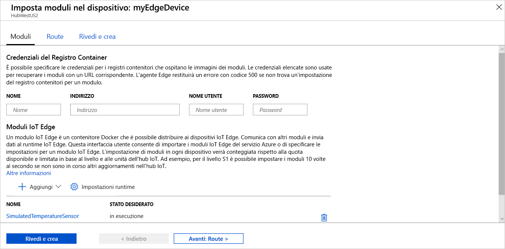

Una delle principali funzionalità di Azure IoT Edge è la possibilità di distribuire codice ai dispositivi IoT Edge dal cloud. I **moduli IoT Edge** sono pacchetti eseguibili implementati come contenitori. In questa sezione viene distribuito un modulo predefinito dalla [sezione Moduli IoT Edge di Azure Marketplace](https://azuremarketplace.microsoft.com/marketplace/apps/category/internet-of-things?page=1&subcategories=iot-edge-modules) direttamente dall'hub IoT.

Questo modulo simula un sensore e invia i dati generati. Si tratta di un codice utile per iniziare a usare IoT Edge, perché è possibile usare i dati simulati per lo sviluppo e i test. Per informazioni specifiche sul funzionamento di questo modulo, è possibile visualizzare il [codice sorgente del sensore temperatura simulato](https://github.com/Azure/iotedge/blob/027a509549a248647ed41ca7fe1dc508771c8123/edge-modules/SimulatedTemperatureSensor/src/Program.cs).

Per distribuire il primo modulo da Azure Marketplace, eseguire i passaggi seguenti:

1. Accedere al [portale di Azure](https://portal.azure.com) e passare all'hub IoT.

1. Nel menu nel riquadro sinistro, in **Gestione dispositivi automatica**, selezionare **IoT Edge**.

1. Fare clic sull'ID del dispositivo di destinazione nell'elenco dei dispositivi.

1. Sulla barra superiore selezionare **Imposta moduli**.

1. Nella sezione **Moduli IoT Edge** della pagina fare clic su **Aggiungi**.

1. Nel menu a discesa selezionare **Modulo del Marketplace**.

   

1. In **Marketplace dei moduli IoT Edge** cercare il modulo "Simulated Temperature Sensor" (Sensore di temperatura simulato) e aprirlo.

1. Si noti che il modulo SimulatedTemperatureSensor è compilato automaticamente. Nelle esercitazioni si userà questa pagina per aggiungere altri moduli alla distribuzione. Per questa guida introduttiva, è sufficiente distribuire un modulo. Non sono necessarie credenziali perché il modulo è pubblico.

   

   Selezionare **Avanti: Route** per continuare con il passaggio successivo della procedura guidata.

1. Nella scheda **Route** della procedura guidata è possibile definire come vengono passati i messaggi tra i moduli e l'hub IoT. I messaggi vengono costruiti mediante coppie nome/valore. Per la guida introduttiva, si vuole che tutti i messaggi da tutti i moduli siano passati all'hub IoT (`$upstream`). Se il modulo non viene compilato automaticamente, aggiungere il codice seguente per il **valore** del **nome** `upstream`:

   ```sql
    FROM /messages/* INTO $upstream
   ```

   Selezionare **Avanti: Rivedi e crea** per continuare con il passaggio successivo della procedura guidata.

1. Nella scheda **Rivedi e crea** della procedura guidata è possibile visualizzare in anteprima il file JSON che definisce tutti i moduli distribuiti nel dispositivo IoT Edge. Si noti che sono inclusi il modulo **SimulatedTemperatureSensor**, nonché due moduli di sistema aggiuntivi denominati **edgeAgent** ed **edgeHub**. Al termine della revisione, selezionare **Crea**.

   Quando si invia una nuova distribuzione a un dispositivo IoT Edge, non viene eseguito il push di alcun elemento al dispositivo. Al contrario, il dispositivo richiede periodicamente eventuali nuove istruzioni all'hub IoT. Se il dispositivo trova un manifesto della distribuzione aggiornato, usa le informazioni sulla nuova distribuzione per eseguire il pull delle immagini dei moduli dal cloud, quindi avvia l'esecuzione dei moduli in locale. Il processo potrebbe richiedere alcuni minuti.

1. Dopo aver creato i dettagli della distribuzione del modulo, verrà nuovamente visualizzata la pagina **IoT Edge** dell'hub IoT. Selezionare il dispositivo dall'elenco dei dispositivi IoT Edge per visualizzarne i dettagli.

1. Nella pagina dei dettagli del dispositivo scorrere verso il basso fino alla scheda **Moduli**. Dovrebbero essere elencati tre moduli: $edgeAgent $edgeHub e SimulatedTemperatureSensor. Se uno o più moduli sono elencati come specificato nella distribuzione ma non segnalati dal dispositivo, il dispositivo IoT Edge ne sta ancora eseguendo l'avvio. Attendere alcuni istanti e selezionare **Aggiorna** nella parte superiore della pagina.

   
