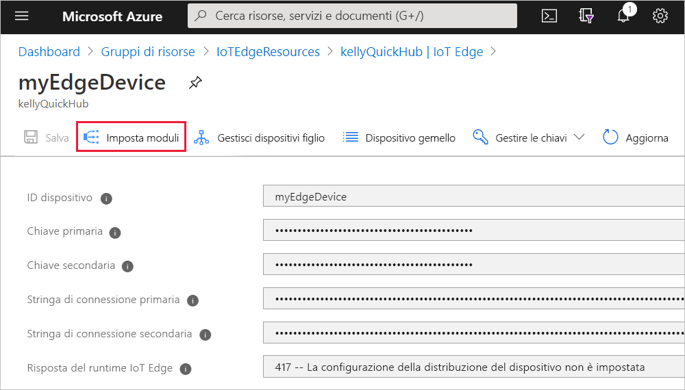
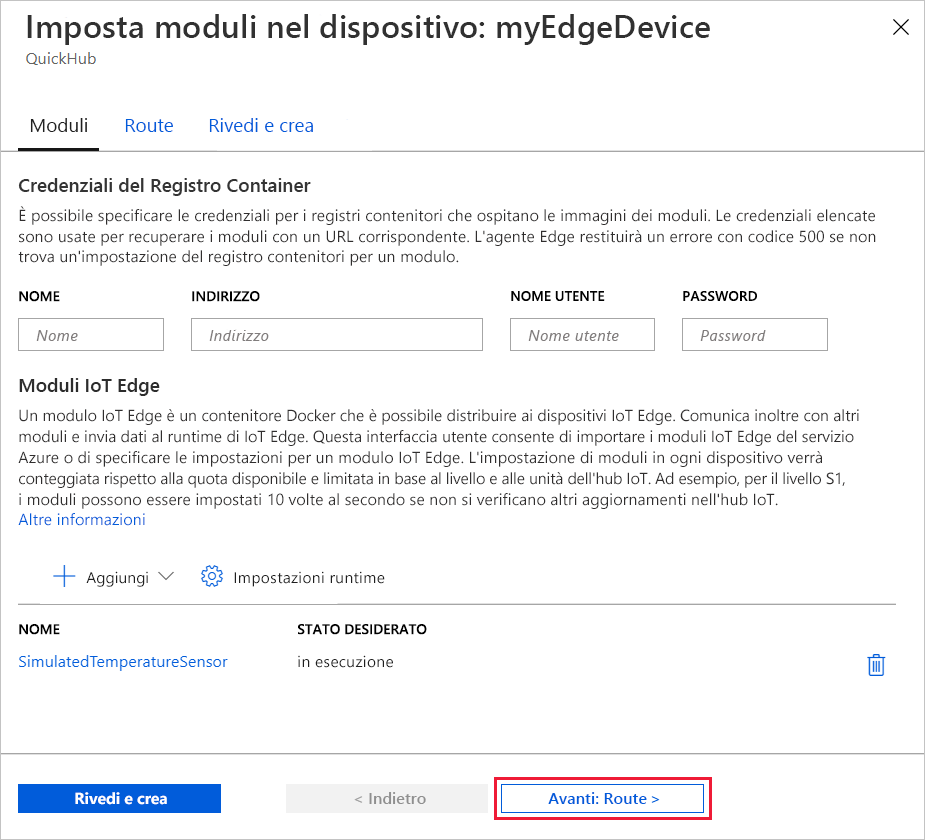
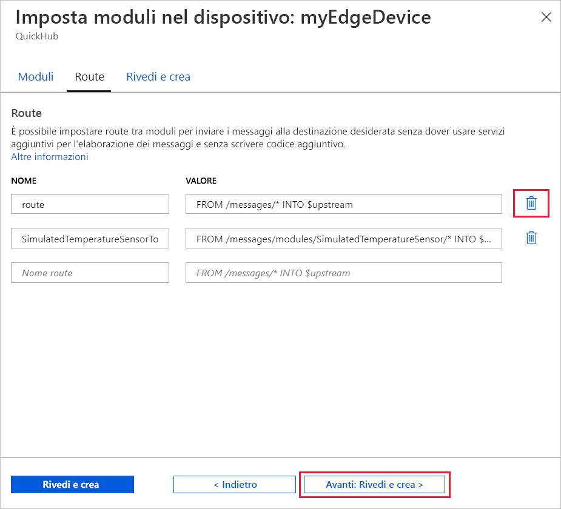
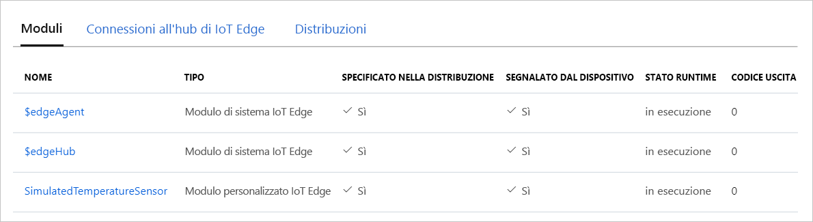

Una delle principali funzionalità di Azure IoT Edge è la possibilità di distribuire codice ai dispositivi IoT Edge dal cloud. I *moduli IoT Edge* sono pacchetti eseguibili implementati come contenitori. In questa sezione viene distribuito un modulo predefinito dalla [sezione Moduli IoT Edge di Azure Marketplace](https://azuremarketplace.microsoft.com/marketplace/apps/category/internet-of-things?page=1&subcategories=iot-edge-modules) direttamente dall'hub IoT.

Questo modulo simula un sensore e invia i dati generati. Si tratta di un codice utile per iniziare a usare IoT Edge, perché è possibile usare i dati simulati per lo sviluppo e i test. Per informazioni specifiche sul funzionamento di questo modulo, è possibile visualizzare il [codice sorgente del sensore temperatura simulato](https://github.com/Azure/iotedge/blob/027a509549a248647ed41ca7fe1dc508771c8123/edge-modules/SimulatedTemperatureSensor/src/Program.cs).

Per distribuire il primo modulo da Azure Marketplace, eseguire i passaggi seguenti:

1. Accedere al [portale di Azure](https://portal.azure.com) e passare all'hub IoT.

1. Nel menu nel riquadro sinistro, in **Gestione dispositivi automatica**, selezionare **IoT Edge**.

1. Fare clic sull'ID del dispositivo di destinazione nell'elenco dei dispositivi.

1. Sulla barra superiore selezionare **Imposta moduli**.

   

1. Nella sezione **Moduli IoT Edge** della pagina fare clic su **Aggiungi** e scegliere **Modulo del Marketplace** dal menu a discesa.

   

1. In **Marketplace dei moduli IoT Edge** cercare il modulo "Simulated Temperature Sensor" (Sensore di temperatura simulato) e aprirlo.

1. Si noti che il modulo SimulatedTemperatureSensor viene aggiunto alla sezione Moduli IoT Edge, con lo stato desiderato **in esecuzione**.

   Selezionare **Avanti: Route** per continuare con il passaggio successivo della procedura guidata.

   

1. Nella scheda **Route** della procedura guidata è possibile definire come vengono passati i messaggi tra i moduli e l'hub IoT. Le route vengono costruite mediante coppie nome/valore. In questa pagina verranno visualizzate due route. La route predefinita denominata **route** invia tutti i messaggi all'hub IoT, denominato `$upstream`. Una seconda route denominata **SimulatedTemperatureSensorToIoTHub** è stata creata automaticamente quando è stato aggiunto il modulo del Marketplace. Questa route invia tutti i messaggi specificamente dal modulo di temperatura simulato all'hub IoT. È possibile eliminare la route predefinita perché in questo caso è ridondante.

   Selezionare **Avanti: Rivedi e crea** per continuare con il passaggio successivo della procedura guidata.

   

1. Nella scheda **Rivedi e crea** della procedura guidata è possibile visualizzare in anteprima il file JSON che definisce tutti i moduli distribuiti nel dispositivo IoT Edge. Si noti che sono inclusi il modulo **SimulatedTemperatureSensor**, nonché i due moduli di runtime denominati **edgeAgent** e **edgeHub**. Al termine della revisione, selezionare **Crea**.

   Quando si invia una nuova distribuzione a un dispositivo IoT Edge, non viene eseguito il push di alcun elemento al dispositivo. Al contrario, il dispositivo richiede periodicamente eventuali nuove istruzioni all'hub IoT. Se il dispositivo trova un manifesto della distribuzione aggiornato, usa le informazioni sulla nuova distribuzione per eseguire il pull delle immagini dei moduli dal cloud, quindi avvia l'esecuzione dei moduli in locale. Il processo potrebbe richiedere alcuni minuti.

1. Dopo aver creato i dettagli della distribuzione dei moduli, la procedura guidata torna nella pagina Dettagli dispositivo. Nella pagina Dettagli dispositivo visualizzare lo stato della distribuzione nella scheda **Moduli**. Dovrebbero essere elencati tre moduli: $edgeAgent $edgeHub e SimulatedTemperatureSensor. Se uno o più moduli sono elencati come specificato nella distribuzione ma non segnalati dal dispositivo, il dispositivo IoT Edge ne sta ancora eseguendo l'avvio. Attendere alcuni istanti e selezionare **Aggiorna** nella parte superiore della pagina.

   
