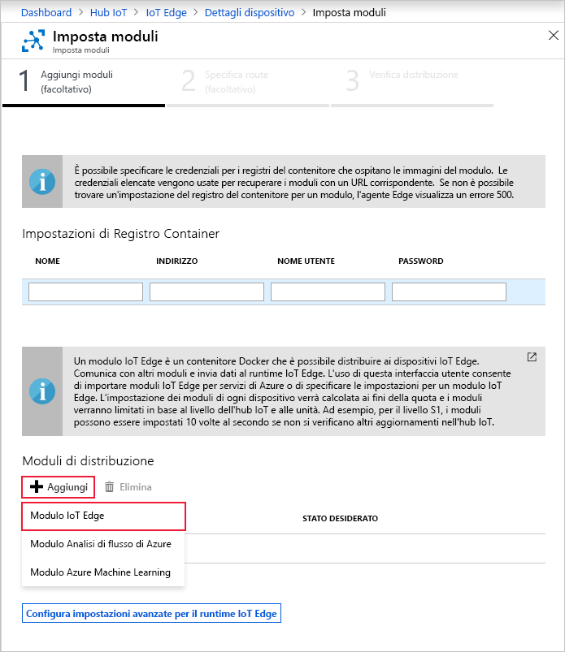

Una delle principali funzionalità di Azure IoT Edge è la possibilità di distribuire i moduli nei dispositivi IoT Edge dal cloud. Un modulo di IoT Edge è un pacchetto eseguibile implementato come contenitore. In questa sezione si distribuisce un modulo che genera dati di telemetria per il dispositivo simulato.

1. Nel portale di Azure passare all'hub IoT.

2. Passare a **IoT Edge** in **Gestione automatica dei dispositivi** e selezionare il dispositivo IoT Edge.

3. Selezionare **Set Modules** (Configura i moduli). Viene aperta nel portale una procedura guidata in tre passaggi, che illustra l'aggiunta di moduli, la definizione di route e la verifica della distribuzione. 

4. Nel passaggio **Aggiungi moduli** della procedura guidata individuare la sezione **Moduli di distribuzione**. Fare clic su **Aggiungi** e quindi selezionare **Modulo IoT Edge**.

   

5. Nel campo **Nome** immettere `tempSensor`.

6. Nel campo **URI immagine** immettere `mcr.microsoft.com/azureiotedge-simulated-temperature-sensor:1.0`.

7. Lasciare invariate le altre impostazioni e selezionare **Salva**.

   

8. Nel primo passaggio della procedura guidata selezionare **Avanti**.

9. Nel passaggio **Specifica route** della procedura guidata deve essere presente una route predefinita che invia tutti i messaggi di tutti i moduli all'hub IoT. In caso contrario, aggiungere il codice seguente e quindi selezionare **Avanti**.

   ```json
   {
       "routes": {
           "route": "FROM /messages/* INTO $upstream"
       }
   }
   ```

10. Nel passaggio **Rivedi distribuzione** della procedura guidata selezionare **Invia**.

11. Tornare alla pagina dei dettagli del dispositivo e selezionare **Aggiorna**. Oltre al modulo edgeAgent, creato quando il servizio è stato avviato per la prima volta, vengono visualizzati un altro modulo di runtime denominato **edgeHub** e il modulo **tempSensor** elencato.

   La visualizzazione dei nuovi moduli potrebbe richiedere qualche minuto. Il dispositivo IoT Edge deve recuperare le informazioni sulla nuova distribuzione dal cloud, avviare i contenitori e quindi segnalare il rispettivo nuovo stato all'hub IoT. 

   
