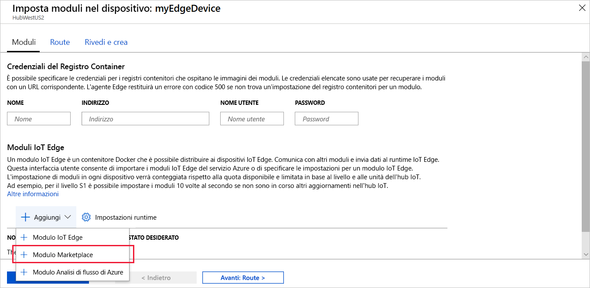

Una delle principali funzionalità di Azure IoT Edge è la possibilità di distribuire i moduli nei dispositivi IoT Edge dal cloud. Un modulo di IoT Edge è un pacchetto eseguibile implementato come contenitore. In questa sezione, verrà distribuito un modulo pre-compilato dalla [sezione moduli IoT Edge di Azure Marketplace](https://azuremarketplace.microsoft.com/en-us/marketplace/apps/category/internet-of-things?page=1&subcategories=iot-edge-modules). Questo modulo genera dati di telemetria per il dispositivo simulato.

1. Nel portale di Azure, immettere `Simulated Temperature Sensor` nella ricerca e aprire il risultato di Marketplace.

   

2. Nel campo **Sottoscrizione**, selezionare la sottoscrizione con l'hub IoT utilizzato, se non è già presente.

3. Nel campo **Hub IoT**, selezionare il nome dell'hub IoT utilizzato, se non è già presente.

4. Fare clic su **Trova dispositivo**, selezionare il dispositivo IoT Edge (denominato `myEdgeDevice`), quindi selezionare **Crea**.

5. Nel passaggio **Aggiungi moduli** della procedura guidata, fare clic sul modulo **SimulatedTemperatureSensor** per verificare le impostazioni di configurazione, fare clic su **Salva** e selezionare **Avanti**.

6. Nel passaggio **Specifica route** della procedura guidata verificare che le route siano impostate correttamente con una route predefinita che invia tutti i messaggi di tutti i moduli all'hub IoT (`$upstream`). In caso contrario, aggiungere il codice seguente e quindi selezionare **Avanti**.

   ```json
    {
    "routes": {
        "route": "FROM /messages/* INTO $upstream"
        }
    }
   ```

7. Nel passaggio **Rivedi distribuzione** della procedura guidata selezionare **Invia**.

8. Tornare alla pagina dei dettagli del dispositivo e selezionare **Aggiorna**. Oltre al modulo edgeAgent, creato quando il servizio è stato avviato per la prima volta, vengono visualizzati un altro modulo di runtime denominato **edgeHub** e il modulo **SimulatedTemperatureSensor** elencato.

   La visualizzazione dei nuovi moduli potrebbe richiedere qualche minuto. Il dispositivo IoT Edge deve recuperare le informazioni sulla nuova distribuzione dal cloud, avviare i contenitori e quindi segnalare il rispettivo nuovo stato all'hub IoT. 

   
