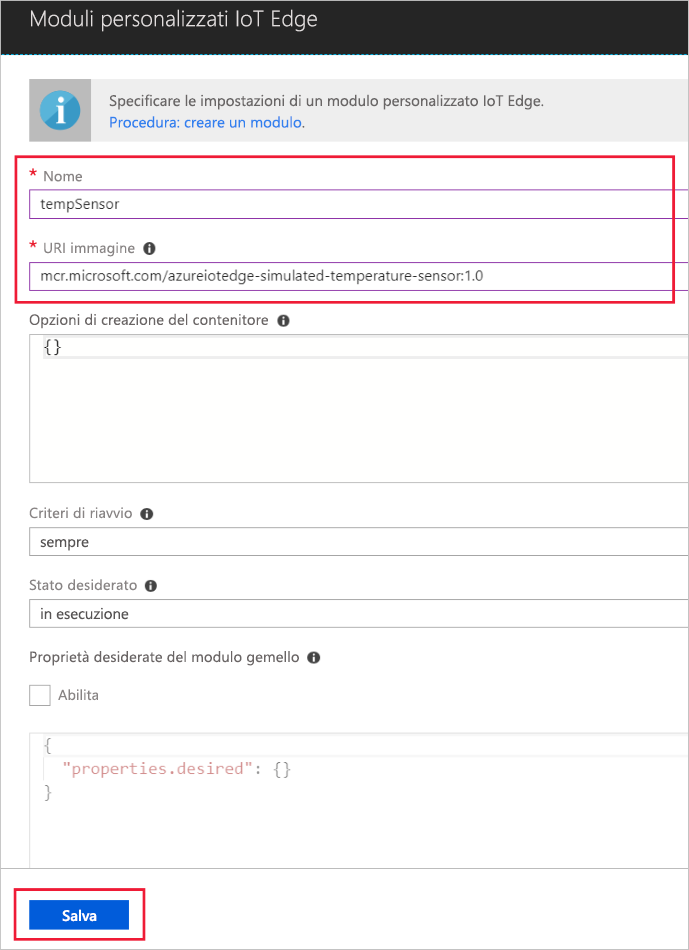

Una delle principali funzionalità di Azure IoT Edge è la possibilità di distribuire i moduli nei dispositivi IoT Edge dal cloud. Un modulo di IoT Edge è un pacchetto eseguibile implementato come contenitore. In questa sezione si distribuisce un modulo che genera dati di telemetria per il dispositivo simulato. 

1. Nel portale di Azure passare all'hub IoT.
1. Passare a **IoT Edge (preview)** (IoT Edge - anteprima) e selezionare il dispositivo IoT Edge.
1. Selezionare **Set Modules** (Configura i moduli).
1. Selezionare **Add IoT Edge Module** (Aggiungi il modulo di IoT Edge).
1. Nel campo **Nome** immettere `tempSensor`. 
1. Nel campo **URI immagine** immettere `microsoft/azureiotedge-simulated-temperature-sensor:1.0-preview`. 
1. Lasciare invariate le altre impostazioni e selezionare **Salva**.

   

1. Nel passaggio **Aggiungi moduli** fare clic su **Avanti**.
1. Nel passaggio **Specify routes** (Specifica route) selezionare **Avanti**.
1. Nel passaggio **Review Template** (Verifica il modello) fare clic su **Invia**.
1. Tornare alla pagina dei dettagli del dispositivo e selezionare **Aggiorna**. Dovrebbe essere visualizzato il nuovo modulo tempSensor in esecuzione insieme al runtime di IoT Edge. 

   ![Visualizzazione di tempSensor nell'elenco di moduli distribuiti][1]

<!-- Images -->
[1]: ../articles/iot-edge/media/tutorial-simulate-device-windows/view-module.png