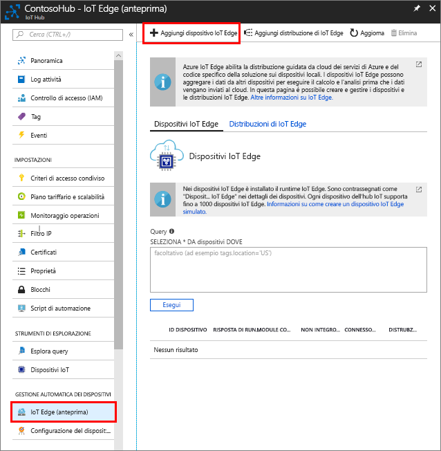

Creare un'identità del dispositivo per il dispositivo simulato in modo che possa comunicare con l'hub IoT. Poiché i dispositivi IoT Edge si comportano e possono essere gestiti in modo diverso dai dispositivi IoT tipici, dichiarare fin dall'inizio che si tratta di un dispositivo IoT Edge. 

1. Nel portale di Azure passare all'hub IoT.
1. Selezionare **IoT Edge** e quindi **Aggiungi dispositivo IoT Edge**.

   

1. Assegnare al dispositivo simulato un ID univoco.
1. Selezionare **Salva** per aggiungere il dispositivo.
1. Selezionare il nuovo dispositivo dall'elenco dei dispositivi.
1. Copiare il valore per **Stringa di connessione - chiave primaria** e salvarlo. Usare questo valore per configurare il runtime IoT Edge nella sezione successiva. 

