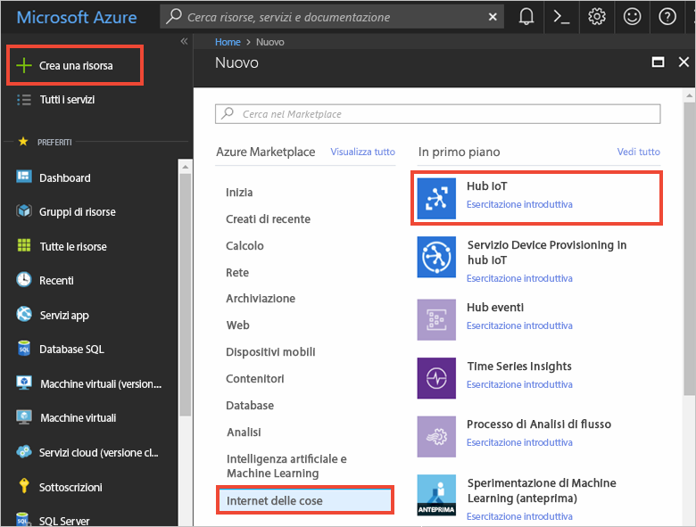
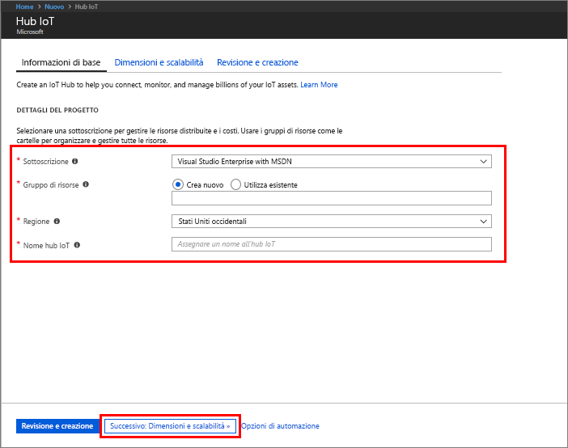
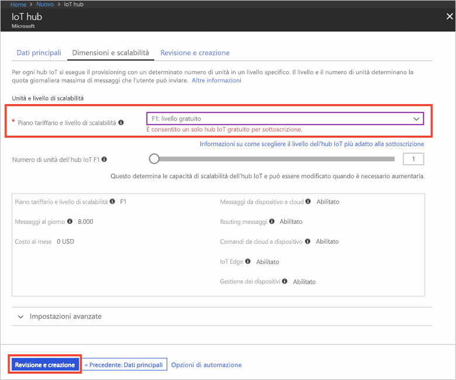

1. Accedere al [portale di Azure](https://portal.azure.com/).

2. Selezionare **Crea una risorsa** > **Internet delle cose** > **Hub IoT**.
   
    

3. Nel riquadro **Hub IoT** immettere le informazioni seguenti per l'hub IoT:

   * **Sottoscrizione**: scegliere la sottoscrizione da usare per creare questo hub IoT.

   * **Gruppo di risorse**: creare un gruppo di risorse per ospitare l'hub IoT o usarne uno esistente. Per altre informazioni, vedere [Usare i gruppi di risorse per gestire le risorse di Azure](../articles/azure-resource-manager/resource-group-portal.md).

   * **Area**: selezionare la località più vicina.

   * **Nome**: creare un nome per l'hub IoT. Se il nome immesso è disponibile, viene visualizzato un segno di spunta verde.

   [!INCLUDE [iot-hub-pii-note-naming-hub](iot-hub-pii-note-naming-hub.md)]

   

4. Selezionare **Next: Size and scale** (Avanti: Dimensioni e scalabilità) per continuare a creare l'hub IoT. 

5. Scegliere un valore per **Piano tariffario e livello di scalabilità**. Per questo articolo selezionare il livello **F1 - Gratuito** se ancora disponibile nella sottoscrizione. Per altre informazioni, vedere [Piano tariffario e livello di scalabilità](https://azure.microsoft.com/pricing/details/iot-hub/).

   

6. Selezionare **Rivedi e crea**.

7. Esaminare le informazioni sull'hub IoT e quindi fare clic su **Crea**. La creazione dell'hub IoT può richiedere alcuni minuti. È possibile monitorare lo stato di avanzamento nel riquadro **Notifiche**.