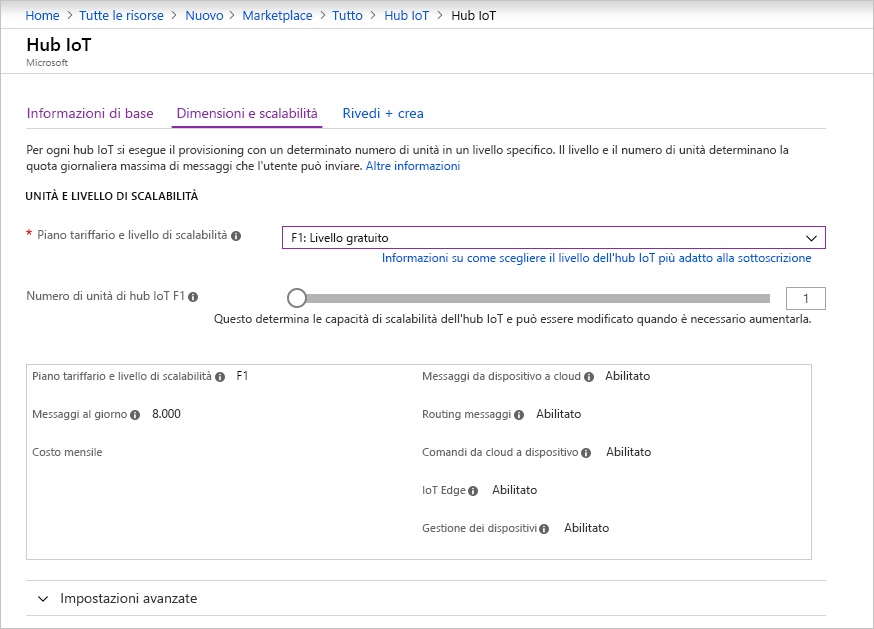
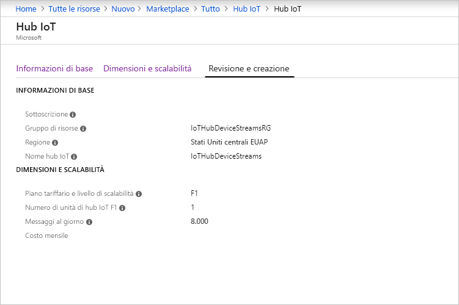

Questa sezione illustra come creare un hub IoT usando il [portale di Azure](https://portal.azure.com).

1. Accedere al [portale di Azure](https://portal.azure.com).

2. Scegliere **+Crea una risorsa** e quindi scegliere **Internet delle cose**.

3. Fare clic su **Hub IoT** nell'elenco a destra. Verrà visualizzata la prima schermata per la creazione di un hub IoT.

   

   Compilare i campi:

   **Sottoscrizione** selezionare la sottoscrizione da usare per l'hub IoT.

   **Gruppo di risorse**: è possibile creare un nuovo gruppo di risorse o selezionarne uno esistente. Per crearne uno nuovo, fare clic su **Crea nuovo** e specificare il nome da usare. Per usare un gruppo di risorse esistente, fare clic su **Usa esistente** e selezionare il gruppo di risorse nell'elenco a discesa. Per altre informazioni, vedere l'articolo su come [gestire gruppi di risorse di Azure Resource Manager](../articles/azure-resource-manager/manage-resource-groups-portal.md).

   **Area**: si tratta dell'area in cui si vuole collocare l'hub. Selezionare un'area che supporta l'anteprima dei flussi dispositivo per l'hub IoT, ossia Stati Uniti centrali o Stati Uniti centrali EUAP.

   **Nome hub IoT**: inserire il nome dell'hub IoT. Il nome deve essere univoco a livello globale. Se il nome immesso è disponibile, viene visualizzato un segno di spunta verde.

   [!INCLUDE [iot-hub-pii-note-naming-hub](iot-hub-pii-note-naming-hub.md)]

4. Fare clic su **Avanti: Dimensioni e piano** per continuare a creare l'hub IoT.

   

   In questa schermata è sufficiente accettare le impostazioni predefinite e fare semplicemente clic su **Revisione e creazione** nella parte inferiore.

   **Piano tariffario e livello di scalabilità**: assicurarsi di selezionare uno degli standard (S1, S2, S3) o il livello gratuito (F1). Questa scelta può anche essere guidata dalle dimensioni della flotta e dai carichi di lavoro non di streaming che si prevedono nell'hub (ad esempio, i messaggi di telemetria). Ad esempio, il livello gratuito è utilizzabile a scopo di test e valutazione. Consente la connessione di 500 dispositivi all'hub IoT e un massimo di 8.000 messaggi al giorno. Ogni sottoscrizione Azure può creare hub IoT nel livello gratuito. 

   **Unità di hub IoT**: questa scelta dipende dal carico di lavoro non di streaming previsto nell'hub. È possibile selezionare 1 per il momento.

   Per informazioni dettagliate sulle altre opzioni relative al livello, vedere [Scegliere il livello più adatto di hub IoT](../articles/iot-hub/iot-hub-scaling.md).

5. Fare clic su **Revisione e creazione** per rivedere le scelte effettuate. Dovrebbe essere visualizzata una schermata simile alla seguente.

   

6. Fare clic su **Crea** per creare il nuovo hub IoT. La creazione dell'hub richiede alcuni minuti.
