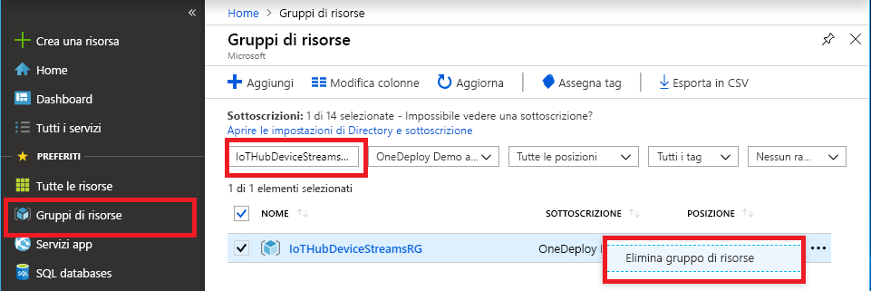

Se si prevede di continuare con il prossimo articolo consigliato, è possibile conservare le risorse già create e riutilizzarle.

In caso contrario, per evitare addebiti, è possibile eliminare le risorse di Azure create in questo articolo. 

> [!IMPORTANT]
> L'eliminazione di un gruppo di risorse è irreversibile. Il gruppo di risorse e tutte le risorse in esso contenute vengono eliminati in modo permanente. Assicurarsi di non eliminare accidentalmente il gruppo di risorse sbagliato o le risorse errate. Se l'hub IoT è stato creato all'interno di un gruppo di risorse esistente che contiene risorse che si vogliono conservare, eliminare solo la risorsa hub IoT invece dell'intero gruppo.
>

Per eliminare un gruppo di risorse per nome:

1. Accedere al [portale di Azure](https://portal.azure.com) e selezionare **Gruppi di risorse**.

1. Nella casella di testo **Filtra per nome** immettere il nome del gruppo di risorse che contiene l'hub IoT. 

1. Nell'elenco dei risultati, a destra del gruppo di risorse, selezionare i puntini di sospensione ( **...** ) e quindi **Elimina gruppo di risorse**.

    

1. Per confermare l'eliminazione del gruppo di risorse, reimmettere il relativo nome e quindi selezionare **Elimina**. Dopo alcuni secondi il gruppo di risorse viene eliminato insieme a tutte le risorse al suo interno.
