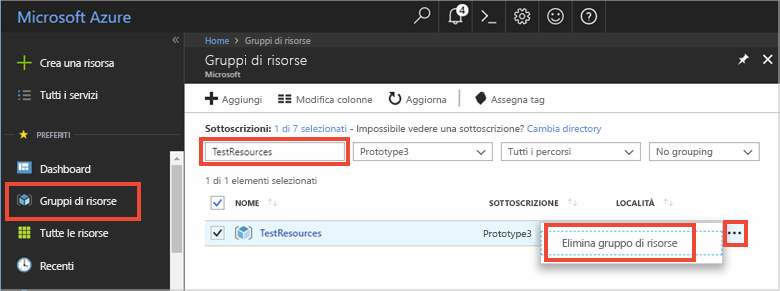

Se si continua con il prossimo articolo consigliato, è possibile conservare le risorse già create e riutilizzarle.

In caso contrario, è possibile eliminare le risorse di Azure create in questo articolo per evitare addebiti. 

> [!IMPORTANT]
> L'eliminazione di un gruppo di risorse è irreversibile. Il gruppo di risorse e tutte le risorse in esso contenute vengono eliminati in modo permanente. Assicurarsi di non eliminare accidentalmente il gruppo di risorse sbagliato o le risorse errate. Se si è creato l'hub IoT all'interno di un gruppo di risorse esistente che contiene risorse che si vogliono conservare, eliminare solo la risorsa dell'hub IoT invece di eliminare il gruppo di risorse.
>

Per eliminare un gruppo di risorse per nome:

1. Accedere al [portale di Azure](https://portal.azure.com) e selezionare **Gruppi di risorse**.

2. Nella casella di testo **Filtra per nome** immettere il nome del gruppo di risorse che contiene l'hub IoT. 

3. A destra del gruppo di risorse nell'elenco dei risultati selezionare **...** quindi su **Elimina gruppo di risorse**.

    

4. Verrà chiesto di confermare l'eliminazione del gruppo di risorse. Digitare di nuovo il nome del gruppo di risorse per confermare e quindi selezionare **Elimina**. Dopo qualche istante il gruppo di risorse e tutte le risorse che contiene vengono eliminati.