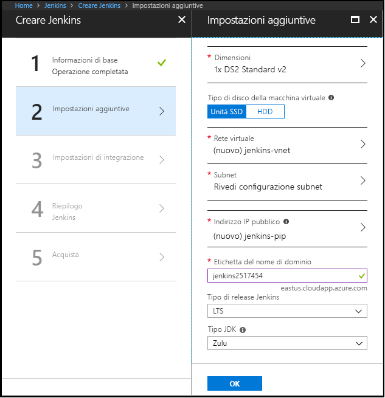

1. Nel browser, aprire il [immagine di Azure Marketplace per Jenkins](https://azuremarketplace.microsoft.com/marketplace/apps/azure-oss.jenkins?tab=Overview).

1. Selezionare **ottenere subito**.

    

1. Dopo aver esaminato le informazioni sui prezzi di termini e i dettagli, selezionare **continua**.

    

1. Selezionare **crea** per configurare il server Jenkins nel portale di Azure. 

    

1. Nel **nozioni di base** , specificare i valori seguenti:

    - **Nome** -immettere `Jenkins`.
    - **Utente** -immettere il nome utente da utilizzare quando si accede alla macchina virtuale in cui è in esecuzione Jenkins.
    - **Tipo di autenticazione** : selezionare questa opzione **Password**.
    - **Password** -immettere la password da utilizzare quando si accede alla macchina virtuale in cui è in esecuzione Jenkins.
    - **Conferma password** -immettere nuovamente la password da utilizzare quando si accede alla macchina virtuale in cui è in esecuzione Jenkins.
    - **Tipo di versione Jenkins** : selezionare questa opzione **LTS**.
    - **Sottoscrizione** -selezionare la sottoscrizione di Azure in cui si desidera installare Jenkins.
    - **Gruppo di risorse** : selezionare questa opzione **Crea nuovo**, quindi immettere un nome per il gruppo di risorse che funge da contenitore logico per la raccolta di risorse che costituiscono l'installazione di Jenkins.
    - **Percorso** : selezionare questa opzione **Stati Uniti orientali**.

    

1. Selezionare **OK** per procedere con il **impostazioni** scheda. 

1. Nel **impostazioni** , specificare i valori seguenti:

    - **Dimensioni** -selezionare l'opzione di ridimensionamento appropriato per la macchina virtuale di Jenkins.
    - **Tipo di disco VM** - specificare l'unità disco rigido (disco rigido) oppure unità SSD (Solid-State) per indicare il tipo di disco di archiviazione è consentita per la macchina virtuale di Jenkins.
    - **Indirizzo IP pubblico** -nome indirizzo IP predefinito corrisponde al nome di Jenkins è specificato nella pagina precedente con il suffisso - IP. È possibile selezionare l'opzione per modificare tale impostazione predefinita.
    - **Etichetta del nome di dominio** -specificare il valore per l'URL completo per la macchina virtuale di Jenkins.

    

1. Selezionare **OK** per procedere con il **riepilogo** scheda.

1. Quando il **riepilogo** scheda vengono visualizzate, le informazioni immesse viene convalidate. Dopo aver visualizzato la **convalida passata** messaggio, seleziona **OK**. 

    

1. Quando il **crea** scheda viene visualizzato, selezionare **crea** per creare la macchina virtuale di Jenkins. Quando il server è pronto, una notifica viene visualizzato nel portale di Azure.

    