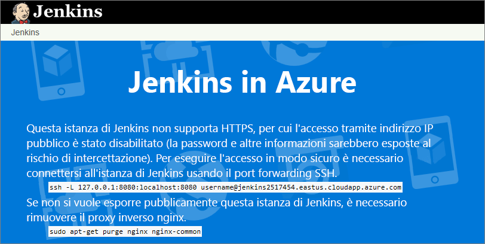
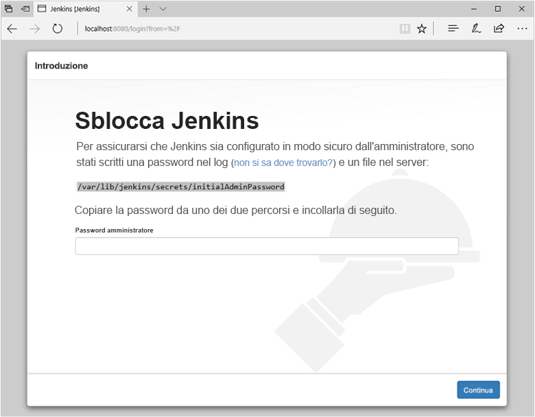
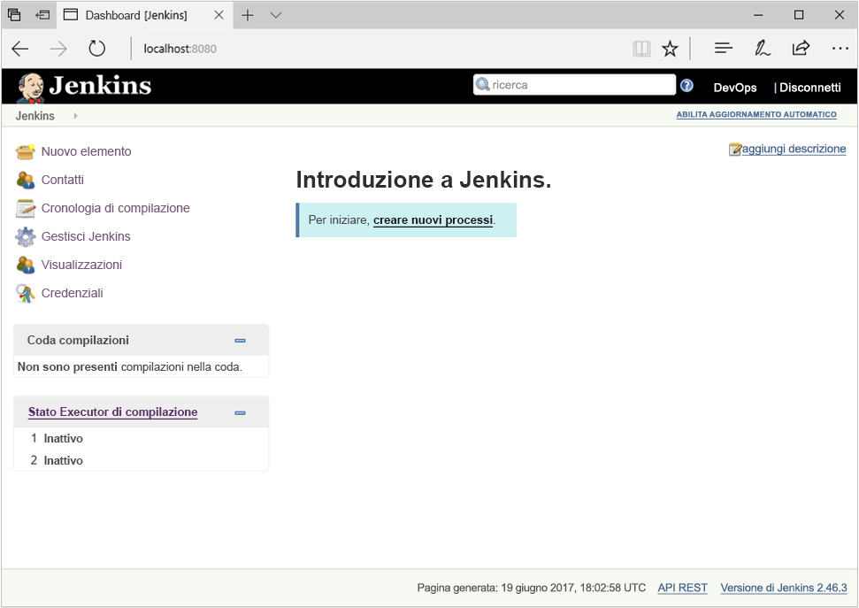
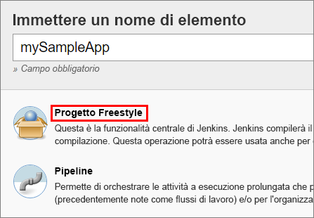
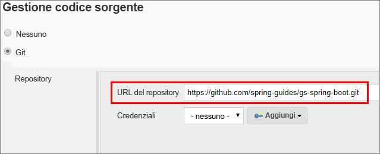
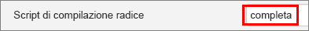
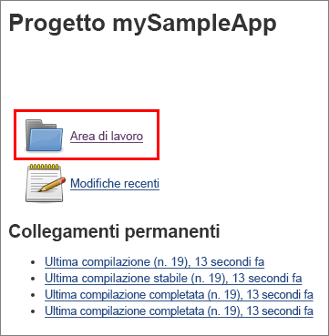

## <a name="prerequisites"></a>Prerequisiti

* Una sottoscrizione di Azure.
* Accesso a SSH nella riga di comando del computer (ad esempio, la shell Bash o [PuTTY](https://www.putty.org/))

[!INCLUDE [quickstarts-free-trial-note](quickstarts-free-trial-note.md)]

## <a name="create-the-jenkins-vm-from-the-solution-template"></a>Creare la VM Jenkins dal modello di soluzione
Jenkins supporta un modello in cui il server Jenkins delega il lavoro a uno o più agenti per consentire a una singola installazione di Jenkins di ospitare un numero elevato di progetti o di fornire ambienti diversi necessari per le compilazioni o i test. I passaggi in questa sezione consentono di installare e configurare un server Jenkins in Azure.

[!INCLUDE [jenkins-install-from-azure-marketplace-image](jenkins-install-from-azure-marketplace-image.md)]

## <a name="connect-to-jenkins"></a>Connettersi a Jenkins

Passare alla macchina virtuale (ad esempio, `http://jenkins2517454.eastus.cloudapp.azure.com/` nel Web browser. Dato che la console Jenkins non è accessibile tramite HTTP non protetto, nella pagina verranno visualizzate istruzioni per accedere alla console Jenkins in modo sicuro dal computer usando un tunnel SSH.



Configurare il tunnel usando il comando `ssh` sulla pagina dalla riga di comando, sostituendo `username` con il nome dell'utente amministratore della macchina virtuale scelto in precedenza durante la configurazione della macchina virtuale dal modello di soluzione.

```bash
ssh -L 127.0.0.1:8080:localhost:8080 jenkinsadmin@jenkins2517454.eastus.cloudapp.azure.com
```

Dopo aver avviato il tunnel, passare a `http://localhost:8080/` nel computer locale. 

Ottenere la password iniziale eseguendo questo comando nella riga di comando mentre si è connessi tramite SSH alla VM Jenkins:

```bash
sudo cat /var/lib/jenkins/secrets/initialAdminPassword
```

Sbloccare il dashboard di Jenkins per la prima volta con questa password iniziale.



Selezionare **Install suggested plugins** (Installa plug-in consigliati) nella pagina successiva e quindi creare un utente amministratore di Jenkins che verrà usato per accedere al dashboard di Jenkins.



Il server Jenkins è ora pronto per la compilazione di codice.

## <a name="create-your-first-job"></a>Creare il primo processo

Selezionare **Create new jobs** (Crea nuovi processi) nella console Jenkins, assegnare il nome **mySampleApp** e selezionare **Freestyle project** (Progetto Freestyle) e quindi **OK**.

 

Selezionare la scheda **Source Code Management** (Gestione del codice sorgente), abilitare **Git** e immettere l'URL seguente nel campo **Repository URL** (URL del repository): `https://github.com/spring-guides/gs-spring-boot.git`

 

Selezionare la scheda **Build** (Compilazione) e quindi **Add build step** (Aggiungi passaggio di compilazione) e **Invoke Gradle script** (Richiama script Gradle). Selezionare **Use Gradle Wrapper** (Usa wrapper di Gradle) e quindi immettere `complete` in **Wrapper location** (Percorso wrapper) e `build` in **Tasks** (Attività).

 

Selezionare **Advanced** (Avanzate) e quindi immettere `complete` nel campo **Root Build script** (Script di compilazione radice). Selezionare **Salva**.

 

## <a name="build-the-code"></a>Compilare il codice

Selezionare **Build Now** (Compila) per compilare il codice e creare il pacchetto dell'app di esempio. Al termine della compilazione, selezionare il collegamento **Workspace** (Area di lavoro) per il progetto.

 

Passare a `complete/build/libs` e verificare che sia presente il file `gs-spring-boot-0.1.0.jar` per assicurarsi che la compilazione sia stata completata correttamente. Il server Jenkins è ora pronto per la compilazione dei progetti dell'utente in Azure.

## <a name="troubleshooting-the-jenkins-solution-template"></a>Risoluzione dei problemi del modello di soluzione Jenkins

Se si rilevano bug relativi al modello di soluzione Jenkins, segnalare un problema nel [repository Jenkins di GitHub](https://github.com/azure/jenkins/issues).

## <a name="next-steps"></a>Passaggi successivi

> [!div class="nextstepaction"]
> [Aggiungere VM di Azure come agenti di Jenkins](/azure/jenkins-azure-vm-agents)