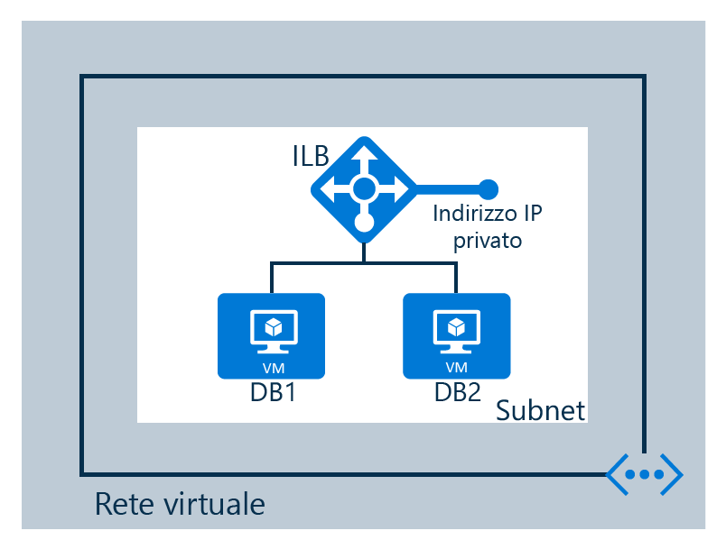

## Scenario

Si sta creando un servizio di bilanciamento del carico interno in base allo scenario seguente

Un servizio di bilanciamento del carico interno è configurato in una rete virtuale  
- 2 macchine virtuali denominate DB1 e DB2 
- endpoint  
- servizio di bilanciamento del carico interno 

<!------HONumber=AcomDC_1223_2015-->
