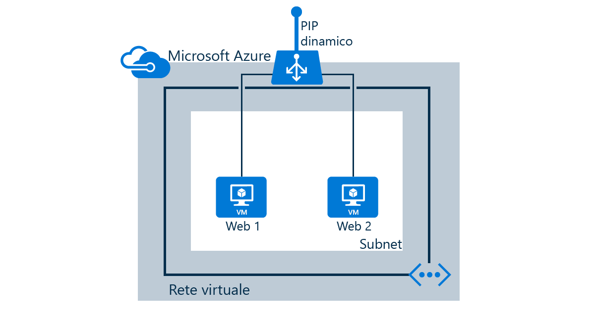

In questo scenario verranno eseguite le seguenti attività:

* Creare un servizio di bilanciamento del carico che riceve il traffico di rete sulla porta 80 e invia il traffico con carico bilanciato alle macchine virtuali "web1" e "web2"
* Creare regole NAT per l'accesso desktop remoto/SSH per le macchine virtuali dietro il servizio di bilanciamento del carico
* Creare probe di integrità

