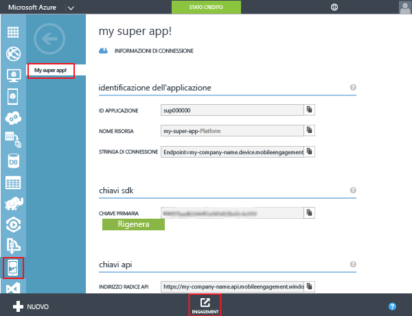
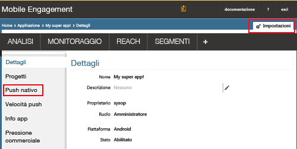
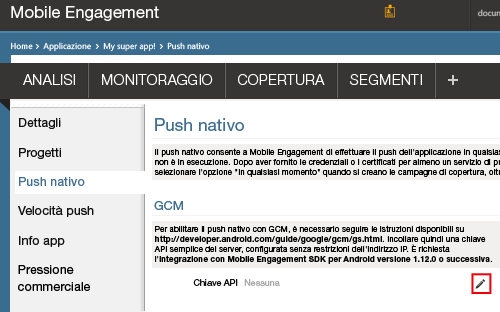
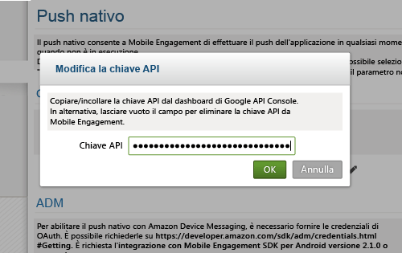
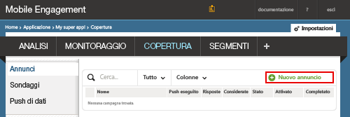
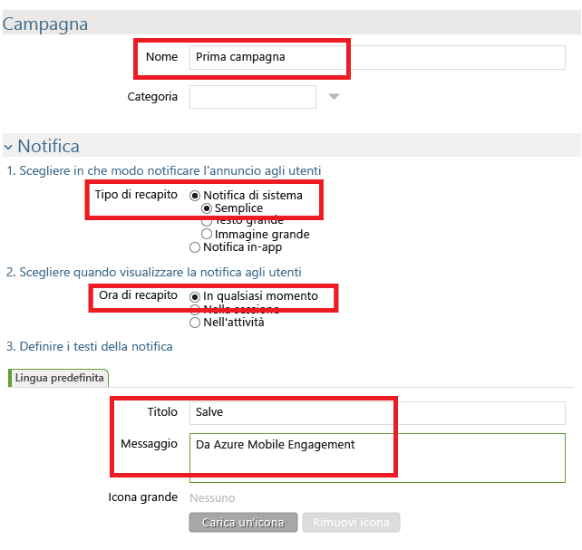
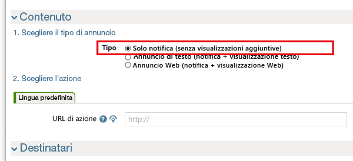
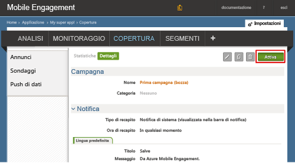

###Concedere a Mobile Engagement l'accesso alla chiave API GCM

Per consentire a Mobile Engagement di inviare notifiche push per conto dell'utente, è necessario concedere l'accesso alla chiave API. A tale scopo, è necessario configurare la chiave e immetterla nel portale di Mobile Engagement.

1. Nel portale di Azure classico verificare che l'app usata per questo progetto sia aperta e fare clic sul pulsante **Attiva** nella parte inferiore della schermata.

	

2. Fare quindi clic sulla sezione **Impostazioni** -> **Push nativo** per immettere la chiave GCM:

	

3. Fare clic sull'icona **Modifica** vicino a **Chiave API** nella sezione delle impostazioni **GCM**, come illustrato di seguito:

	

4. Nella finestra a comparsa incollare la chiave del server GCM ottenuta prima e quindi fare clic su **OK**.

	

##Inviare una notifica all'app

A questo punto si crea una campagna di notifica push semplice che invia una notifica push all'app.

1. Passare alla scheda **REACH** nel portale di Mobile Engagement.

2. Fare clic su **Nuovo annuncio** per creare una campagna di notifica push.

	

3. Impostare il primo campo della campagna seguendo questa procedura:

	

	a. Assegnare un nome alla campagna.

	b. Selezionare **Tipo di recapito** come *Notifica di sistema -> Semplice*: si tratta di un tipo di notifica push Android semplice con un titolo e una breve riga di testo.

	c. Per **Ora di recapito** selezionare *In qualsiasi momento* per consentire all'app di ricevere una notifica anche se non è stata avviata.

	d. Nel testo della notifica digitare il **titolo** che apparirà in grassetto nel push.

	e. Digitare quindi il messaggio nel campo **Messaggio**.

4. Scorrere verso il basso e nella sezione **Contenuto** selezionare **Solo notifica**.

	

5. L'impostazione della campagna più semplice possibile è stata completata. Ora scorrere nuovamente verso il basso e fare clic sul pulsante **Crea** per salvare la campagna.

6. Come ultimo passaggio, fare clic su **Attiva** per attivare la campagna e inviare le notifiche push.

	

<!---HONumber=AcomDC_0330_2016-->