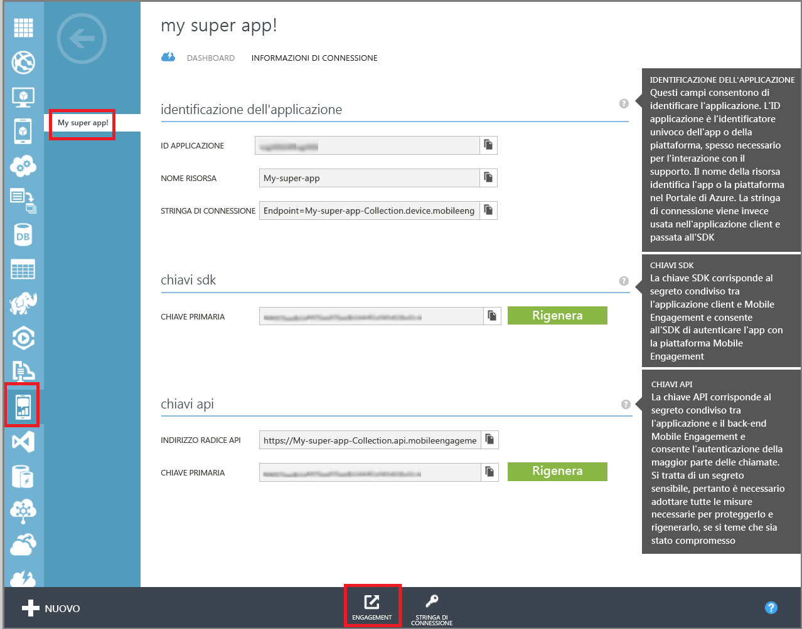
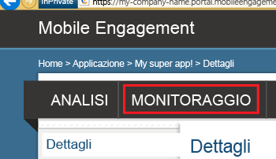
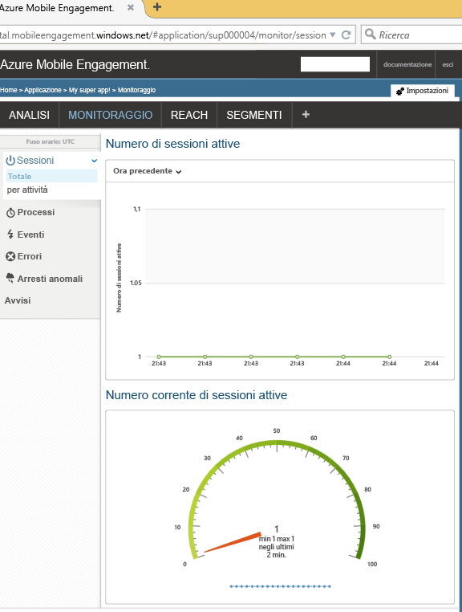

Questa sezione descrive come assicurarsi che l'app si connetta al back-end di Mobile Engagement usando la funzionalità di monitoraggio in tempo reale di Mobile Engagement.

1. Passare al portale di Mobile Engagement. Verificare che l'app usata per questo progetto sia attiva e fare clic sul pulsante **Engage** nella parte inferiore della schermata:

	 

2. Viene visualizzato il portale Mobile Engagement. Fare clic sulla scheda **Monitoraggio**.
	 
	

3. Verranno visualizzati, in tempo reale, tutti i dispositivi in cui l'app verrà avviata.
	 
4. Avviare l'app nell’emulatore/simulatore o su un dispositivo connesso. Se l'integrazione è corretta si noterà una sessione di monitoraggio, che significa che l'app ora è collegata al back-end di Mobile Engagement e sta inviando dati ad esso.
	
	 

<!---HONumber=Sept15_HO4-->