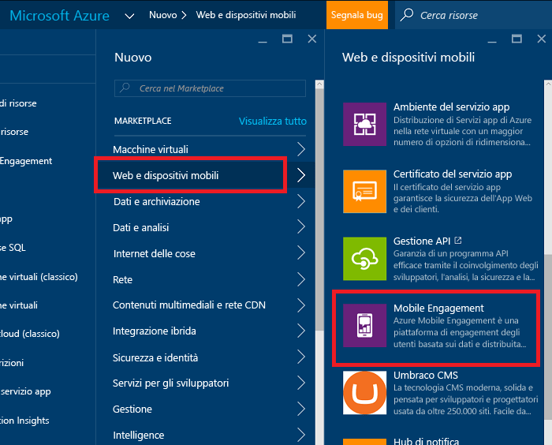
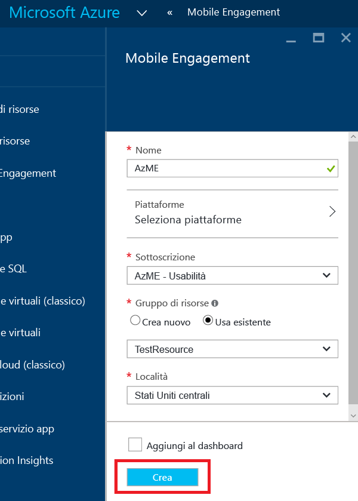
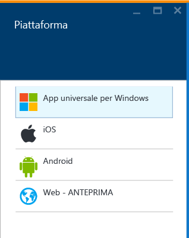
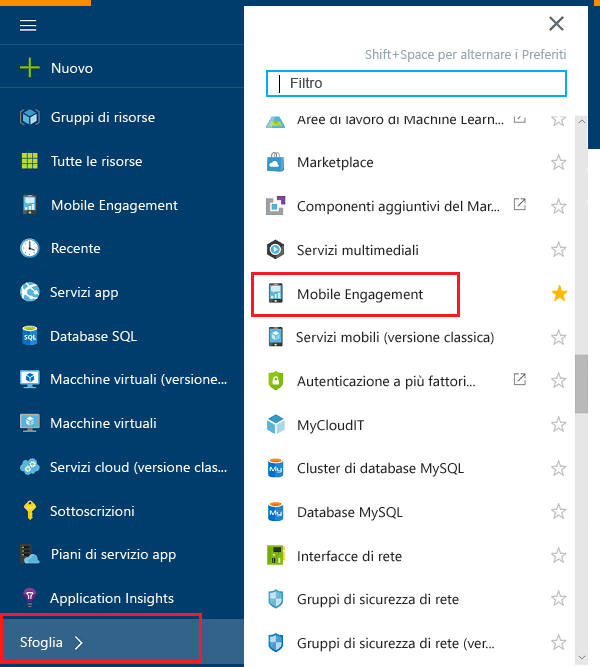
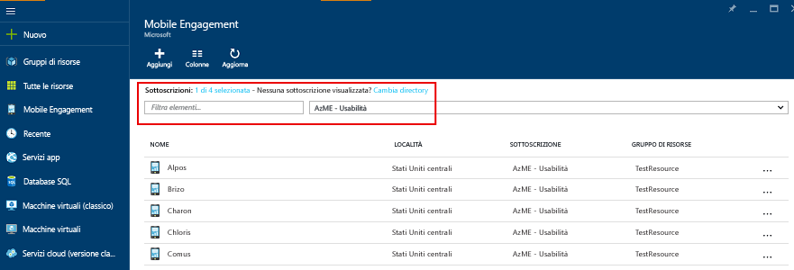
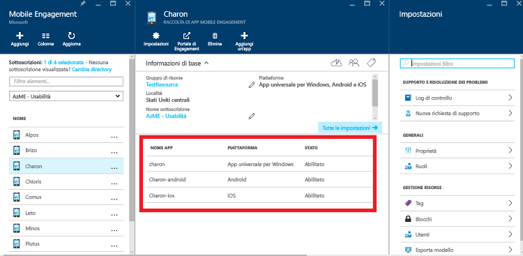
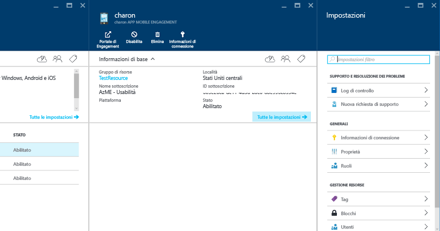
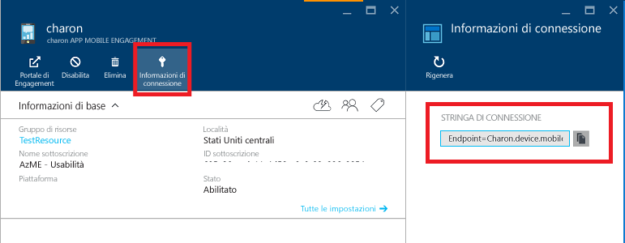

1. Accedere al [portale di Azure](https://portal.azure.com).
2. Fare clic su **Nuovo**, quindi su **Web e dispositivi mobili** e infine su **Mobile Engagement**.
   
    
3. Nel pannello **New Mobile Engagement App Collection** (Nuova raccolta di app Mobile Engagement) visualizzato si creerà una raccolta di app invece che un'app come nel portale di Azure classico. Immettere le seguenti informazioni:
   
    
   
   * **Nome**: Nome of your *raccolta di applicazioni* 
   * **Piattaforme**: selezionare le piattaforme di destinazione per l'app nel pannello Piattaforme che verrà aperto. Ad esempio, se è necessaria un'app sia per iOS che per Android, selezionare entrambe le piattaforme per creare due app in questa raccolta di app. 
     
      
   * **Sottoscrizione**: selezionare la sottoscrizione di Azure. 
   * **Gruppo di risorse**: selezionare il gruppo di risorse di Azure in cui inserire questa risorsa di Azure (Raccolta di app Mobile Engagement). È possibile scegliere di crearne uno nuovo.  
   * **Località**: area in cui verranno archiviati i dati su questa raccolta di app e su questa app.
4. Esplorare le raccolte di app Mobile Engagement facendo clic su **Esplora** e cercando **Mobile Engagement**
   
    
5. Verrà visualizzato un elenco di raccolte di app Mobile Engagement: assicurarsi di avere la stessa sottoscrizione di Azure in cui è stata creata la raccolta di app.
   
    
6. Fare clic sulla raccolta di app creata nel passaggio precedente per aprire il pannello della risorsa raccolta di app che visualizzerà le diverse app presenti in questa raccolta di app. 
   
    
7. Fare clic sull'app creata per la piattaforma per cui si sta sviluppando. 
   
    
8. Fare clic sul pulsante di comando **Informazioni di connessione** in alto per aprire il pannello Informazioni di connessione e copiare la stringa di connessione. 
   
    

