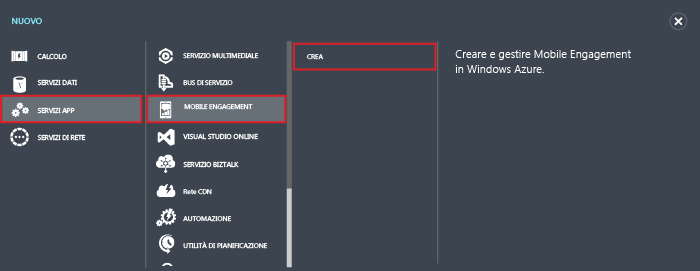
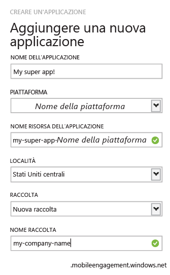

1. Accedere al [portale di Azure classico](https://manage.windowsazure.com)e quindi fare clic su **+NUOVO** nella parte inferiore della schermata.
2. Fare clic su **Servizi app**, quindi su **Mobile Engagement** e infine su **Crea**.
   
       
3. Nella finestra popup che viene visualizzata, immettere le informazioni seguenti:
   
       
   
   * **Nome dell'applicazione**: nome dell'applicazione. 
   * **Piattaforma**: piattaforma di destinazione per l'app. È necessario creare un'app Mobile Engagement per ogni piattaforma di destinazione per l'applicazione per dispositivi mobili. 
   * **Nome della risorsa dell'applicazione**: nome usato per rendere accessibile l'applicazione mediante API e URL. 
   * **Località**: area/data center in cui verranno ospitate l'app e la raccolta di app.
   * **Raccolta**: selezionare una raccolta creata in precedenza oppure 'Nuova raccolta'.
   * **Nome raccolta**: identifica il gruppo di applicazioni. Garantisce, inoltre, che tutte le app siano incluse in un gruppo per consentire calcoli aggregati delle metriche. Se applicabile, è possibile usare il nome della società o del reparto.
4. Selezionare l'app appena creata nella scheda **Applicazioni** .
5. Fare clic su **Informazioni di connessione** per visualizzare le impostazioni di connessione da inserire nell'integrazione dell'SDK nell'app per dispositivi mobili.
6. Copiare la **stringa di connessione** , necessaria per identificare l'app nel codice dell'applicazione e connettersi a Mobile Engagement dall'app.
   
       

<!--HONumber=Jan17_HO3-->

