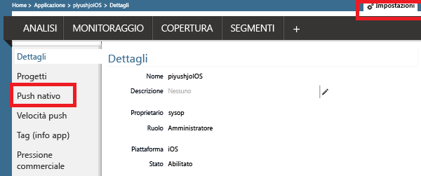
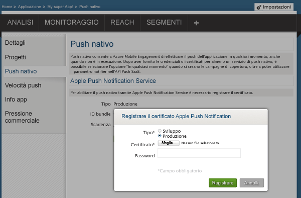
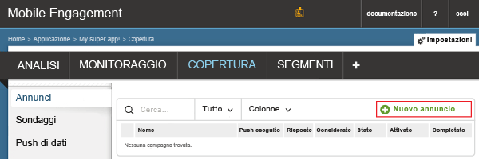
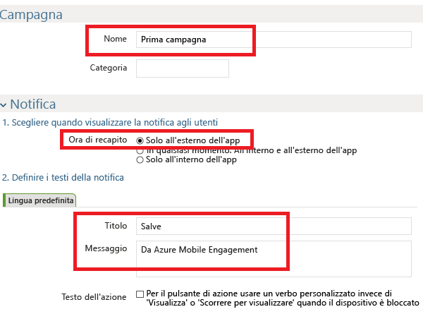
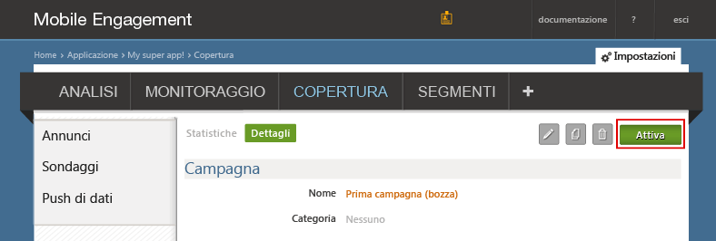
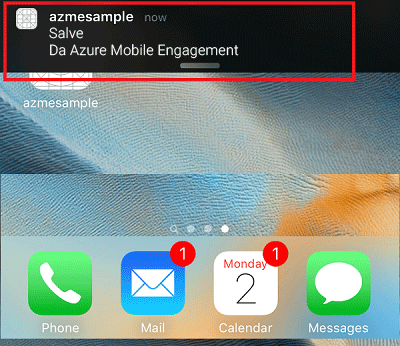
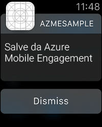

### Concedere a Mobile Engagement l'accesso al certificato push
Per consentire a Mobile Engagement di inviare notifiche push per conto dell'utente, è necessario concedere l'accesso al certificato. A tale scopo, è necessario configurare il certificato e immetterlo nel portale di Mobile Engagement. Assicurarsi di avere ottenuto il certificato con estensione p12 come descritto nella [documentazione di Apple](https://developer.apple.com/library/prerelease/ios/documentation/IDEs/Conceptual/AppDistributionGuide/AddingCapabilities/AddingCapabilities.html#//apple_ref/doc/uid/TP40012582-CH26-SW6)

1. Passare al portale di Mobile Engagement. Verificare la posizione corretta e fare clic sul pulsante **Attiva** nella parte inferiore:
   
    
2. Verrà visualizzata la pagina **Impostazioni** nel portale di Engagement. Da questa posizione fare clic sulla sezione **Push nativo** per aprire il certificato p12:
   
    
3. Selezionare il certificato p12, caricarlo e digitare la password:
   
    

## Inviare una notifica all'app
Si creerà ora una semplice campagna di notifica push per l'invio di un push all'app.

1. Passare alla scheda **Reach** nel portale di Mobile Engagement.
2. Fare clic su **Nuovo annuncio** per creare la campagna di push.
   
    
3. Configurare i primi campi della campagna:
   
    
   
   * Fornire un **Nome** per la campagna 
   * Per **Ora di consegna** selezionare **Out of app only** (Solo all'esterno dell'app): si tratta di un tipo di notifica push Apple semplice che include testo.
   * Nel testo della notifica digitare innanzitutto il **titolo** che sarà la prima riga del push.
   * Digitare quindi il **messaggio** che costituirà la seconda riga
4. Scorrere verso il basso e nella sezione contenuto selezionare **Solo notifica**
   
    
5. L'impostazione della campagna più semplice è stata completata. Ora scorrere verso il basso e fare clic sul pulsante **Crea** per salvare la campagna di notifica push. 
6. Infine, fare clic sul **Attiva** per inviare notifiche push. 
   
    
7. Sarà possibile ricevere la notifica sul dispositivo iOS nel centro di notifica, come mostrato di seguito:
   
    
8. Se si dispone di un controllo Apple abbinato a questo dispositivo iOS, allora verrà visualizzata la notifica nel controllo Apple:
   
    

