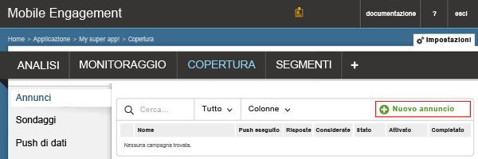
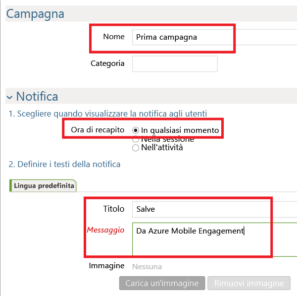
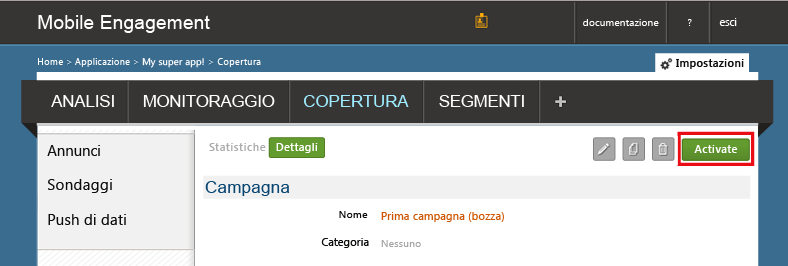

A questo punto si crea una campagna di notifica push semplice che invia una notifica push all'app.

1. Passare alla scheda **REACH** nel portale di Mobile Engagement.

2. Fare clic su **Nuovo annuncio** per creare una campagna di notifica push.

	

3. Impostare il primo campo della campagna effettuando i passaggi seguenti:

	

	a. Fornire un **Nome** per la campagna.

	b. Selezionare l'**Ora di recapito** su *Qualsiasi ora*

	d. Nel testo della notifica digitare il **titolo** che apparirà in grassetto nel push.

	e. Digitare quindi il **messaggio**

4. Scorrere verso il basso e nella sezione **Contenuto** selezionare **Solo notifica**.

	

5. L'impostazione della campagna più semplice possibile è stata completata. Ora scorrere nuovamente verso il basso e fare clic sul pulsante **Crea** per salvare la campagna.

6. Come ultimo passaggio, fare clic su **Attiva** per attivare la campagna e inviare le notifiche push.

	

 

<!---HONumber=Sept15_HO4-->