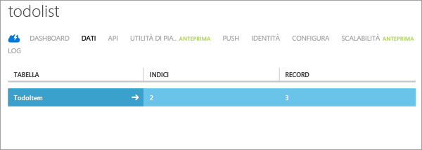

La fase finale di questa esercitazione prevede la compilazione e l'esecuzione della nuova app.

1. Individuare il percorso in cui sono stati salvati i file compressi del progetto ed espanderli nel computer in uso nella directory dei progetti di Android Studio.

2. Aprire Android Studio. Se viene visualizzato l'ultimo progetto al quale si è lavorato, chiuderlo (File = > Close Project).

3. Selezionare **Open an existing Android Studio project**, passare al percorso del progetto e quindi fare clic su **OK**.

 	

4. Nella finestra **Project Explorer** a sinistra assicurarsi che sia selezionata la scheda *Project*, quindi aprire **app**, **src**, **java** e fare doppio clic su **ToDoactivity**.

   	

5. Se è stata scaricata la versione 2.0 dell'SDK, è necessario aggiornare il codice con l'URL e la chiave del servizio mobile:
	- 	Trovare il metodo **OnCreate** in **TodoActivity.java** e individuare il codice che crea un'istanza del client di Servizi mobili. Il codice è visibile nell'immagine precedente.
	- 	Sostituire "MobileServiceUrl" con l'URL effettivo del servizio mobile.
	- 	Sostituire "AppKey" con la chiave del servizio mobile.
	- 	Per informazioni dettagliate, vedere l'esercitazione [Aggiungere Servizi mobili a un'app esistente](../articles/mobile-services/mobile-services-android-get-started-data.md). 

6. Scegliere **Run** dal menu **Run** per avviare il progetto nell'emulatore di Android.

	> [AZURE.IMPORTANT]Per poter eseguire il progetto nell'emulatore di Android, è necessario definire almeno un dispositivo Android Virtual Device (AVD). Usare AVD Manager per creare e gestire questi dispositivi.

7. Nell'app digitare un testo significativo, ad esempio _Complete the tutorial_ e quindi fare clic su **Add**.

   	![][10]

   	Verrà inviata una richiesta POST al nuovo servizio mobile ospitato in Azure. I dati della richiesta vengono inseriti nella tabella TodoItem. Gli elementi archiviati nella tabella vengono restituiti dal servizio mobile e i dati vengono visualizzati nell'elenco.

	> [AZURE.NOTE]È possibile esaminare il codice che accede al servizio mobile per eseguire una query e inserire i dati, disponibile nel file ToDoActivity.java.

8. Nel portale di gestione fare clic sulla scheda **Dati** e quindi sulla tabella **TodoItems**.

   	

   	In questo modo sarà possibile visualizzare i dati inseriti nella tabella dall'app.

   	

<!-- Images. -->
[0]: ./media/mobile-services-android-get-started/mobile-quickstart-completed-android.png
[6]: ./media/mobile-services-android-get-started/mobile-portal-quickstart-android.png
[7]: ./media/mobile-services-android-get-started/mobile-quickstart-steps-android.png
[8]: ./media/mobile-services-android-get-started/Android-Studio-quickstart.png
[10]: ./media/mobile-services-android-get-started/mobile-quickstart-startup-android.png
[11]: ./media/mobile-services-android-get-started/mobile-data-tab.png
[12]: ./media/mobile-services-android-get-started/mobile-data-browse.png
[14]: ./media/mobile-services-android-get-started/android-studio-import-project.png
[15]: ./media/mobile-services-android-get-started/mobile-services-import-android-project.png

<!-- URLs. -->
[Add Mobile Services to an existing app]: ../articles/mobile-services/mobile-services-android-get-started-data.md
[Get started with authentication]: ../articles/mobile-services/mobile-services-android-get-started-users.md
[Get started with push notifications]: ../articles/mobile-services/mobile-services-javascript-backend-android-get-started-push.md
[Android SDK]: https://go.microsoft.com/fwLink/p/?LinkID=280125
[Android Studio]: https://developer.android.com/sdk/index.html
[Mobile Services Android SDK]: https://go.microsoft.com/fwLink/p/?LinkID=266533

[Management Portal]: https://manage.windowsazure.com/

<!---HONumber=August15_HO6-->