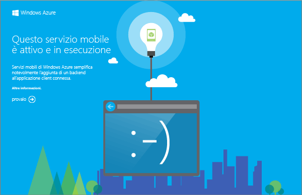


Il progetto di servizio mobile scaricato consente di eseguire il nuovo servizio mobile direttamente sul computer locale o sulla macchina virtuale, al fine di semplificare il debug del codice del servizio ancor prima di pubblicarlo in Azure.

In questa sezione la nuova app verrà testata nel servizio mobile in esecuzione localmente.

1. Individuare il percorso in cui sono stati salvati i file compressi del progetto ed espanderli sul computer in uso, quindi aprire il file di soluzione in Visual Studio.

2. Premere **F5** per ricompilare il progetto e avviare il servizio mobile localmente.

	

	Al termine dell'avvio del servizio mobile, verrà visualizzata una pagina Web.

3. In Visual Studio, in Esplora soluzioni fare clic con il pulsante destro del mouse sul progetto dell'app client, scegliere **Imposta come progetto di avvio**, quindi premere **F5** per ricompilare il progetto e avviare l'app.

	L'app verrà avviata e si connetterà all'istanza del servizio mobile locale.	

4. Nell'app digitare un testo significativo, ad esempio _Complete the tutorial_, in **Insert a TodoItem**, quindi fare clic su **Save**.

	Verrà inviata una richiesta POST al servizio mobile locale. I dati della richiesta vengono inseriti nella tabella TodoItem. Gli elementi archiviati nella tabella vengono restituiti dal servizio mobile e i dati vengono visualizzati nella seconda colonna dell'app.<!--HONumber=42-->
