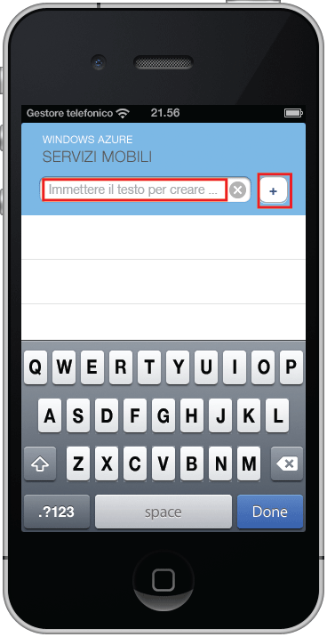

La fase finale di questa esercitazione prevede la compilazione e l'esecuzione della nuova app.

1. Individuare il percorso in cui sono stati salvati i file compressi del progetto ed espanderli nel computer in uso, quindi aprire il file di progetto tramite Xcode.

2. Fare clic su **Esegui** per compilare il progetto e avviare l'app nell'emulatore iPhone.

3. Nell'app digitare un testo significativo, ad esempio _Complete the tutorial_, quindi fare clic sull'icona con il segno PIÙ (**+**).

   	

   	Verrà inviata una richiesta POST al nuovo servizio mobile ospitato in Azure. I dati della richiesta vengono inseriti nella tabella TodoItem. Gli elementi archiviati nella tabella vengono restituiti dal servizio mobile e i dati vengono visualizzati nell'elenco.

 	

<!-----HONumber=Oct15_HO3-->