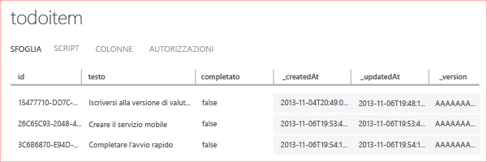

La fase finale di questa esercitazione prevede la compilazione e l'esecuzione della nuova app.

1. Individuare il percorso in cui sono stati salvati i file compressi del progetto ed espanderli sul computer in uso, quindi aprire il file di soluzione in Visual Studio.

2. Premere **F5** per ricompilare il progetto e avviare l'app.

3. Nell'app digitare un testo significativo, ad esempio *Complete the tutorial*, in **Insert a TodoItem** e quindi fare clic su **Save**.

   Verrà inviata una richiesta POST al nuovo servizio mobile ospitato in Azure. I dati della richiesta vengono inseriti nella tabella TodoItem. Gli elementi archiviati nella tabella vengono restituiti dal servizio mobile e i dati vengono visualizzati nella seconda colonna dell'app.

4. (Facoltativo) In una soluzione universale Windows, cambiare il progetto di avvio predefinito specificando l'altra app ed eseguire di nuovo l'app.

	Si noti che i dati salvati dal passaggio precedente saranno caricati dal servizio mobile dopo l'avvio dell'app.
 
4. Tornare al portale di gestione e fare clic sulla scheda **Dati** e quindi sulla tabella **TodoItems**.

   	

   In questo modo sarà possibile visualizzare i dati inseriti nella tabella dall'app.

   	

<!--HONumber=42-->
